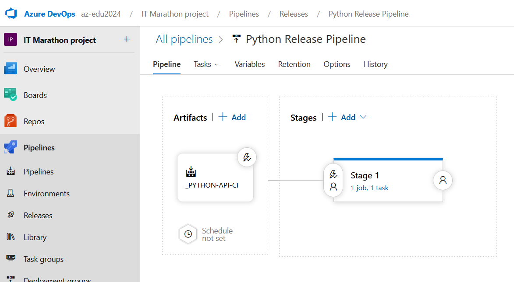

# 2. Create a Project


## Pipelines:


### Agents:


### It MUST BE after activation:


### Run Pipelines:

#### Frontend pipelines:  
    Source code must be on 'frontend' folder on git.


## Release Pipelines:


### NET Release Pipeline:


### Python Release Pipeline:



### Frontend Release Pipeline:


#### AzureBlob File Copy deploy

Task 'AzureBlob File Copy' - generate errors for Windows path:

    ##[error]The current operating system is not capable of running this task. That typically means the task was written for Windows only. For example, written for Windows Desktop PowerShell.

#### Azure CLI deploy

Inline Script:
```
az storage blob upload-batch -d '$web' -s ./ --account-name stitmarathonlexxaiprod
```
Working Directory:
```
$(System.DefaultWorkingDirectory)/_Frontend-App-CI/frontend/browser
```


### Result of deploy 


