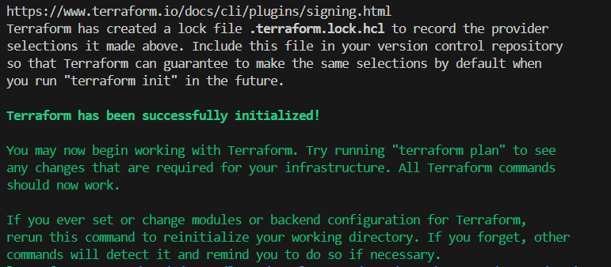

# Prepare data for fill  devops\terraform\terraform.tfvars

## ./setup_grafana_datasources.sh
```
$ cd devops/terraform
$ chmod +x 
$ source ./setup_grafana_datasources.sh

Using Subscription ID: ......
Infinity datasource credentials not found. Creating new ones.
...
TF_VAR_azure_client_secret: [Hidden for security. Use the TF_VAR_azure_client_secret environment variable]
TF_VAR_infinity_client_secret: [Hidden for security. Use the TF_VAR_infinity_client_secret environment variable]

$ echo $TF_VAR_azure_client_secret
vGt......................

echo $TF_VAR_infinity_client_secret
Ez-8.....................

```


## ssh keygen
```
$ ssh-keygen -t ed25519
Generating public/private ed25519 key pair.
...
The key's randomart image is:
+--[ED25519 256]--+
|O**+. o* ..      |
|O=o+..o.=..E     |
|=o= +o*o++       |
|.+...B =+.       |
|  ... ..S..      |
|        o=       |
|       ...       |
|        .        |
|                 |
+----[SHA256]-----+
```
$ cat ~/.ssh/id_ed25519.pub
```
ssh-ed25519 AAAAC3NzaC1lZDI1N....
```
## terraform init
```
$ terraform init
Initializing the backend...
Initializing modules...
- app_dotnet in modules/07_app_dotnet
- app_python in modules/09_app_python
- bastion in modules/03_bastion
- database in modules/04_database
- email in modules/08_email
....
```
