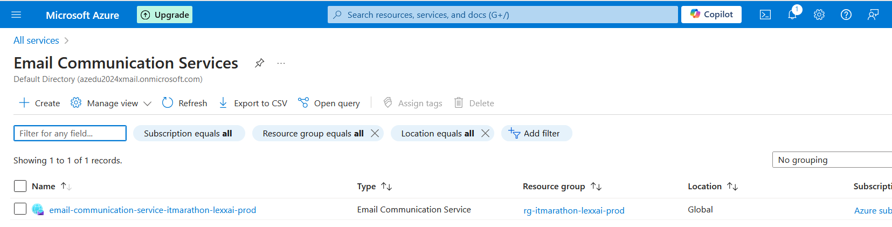

# Prepare install
## Open WSL (Ubuntu) terminal on Windows of VS Code. 


## Install Terraform
```
$ curl -fsSL https://apt.releases.hashicorp.com/gpg | sudo gpg --dearmor -o /usr/share/keyrings/hashicorp-archive-keyring.gpg
$ sudo apt update && sudo apt install terraform
$ terraform --version
Terraform v1.9.7
on linux_amd64
...
```

## Install Azure CLI
```
$ curl -sL https://aka.ms/InstallAzureCLIDeb | sudo bash
```

##  Azure CLI logon
```
$ az login
```
Copy printed URL Link and open it on browser for auth in Azure Portal. After success login, 'az login' should finish work in console automatically.

## Install required packages for scripts.

```
$ sudo apt install jq
```
## Prepare default terraform.tfvars
```
$ cd devops\terraform
$ cp terraform.tfvars.template terraform.tfvars
```

# Prepare data for fill devops\terraform\terraform.tfvars

## ./setup_grafana_datasources.sh
```
$ cd devops/terraform
$ chmod +x ./setup_grafana_datasources.sh
$ source ./setup_grafana_datasources.sh

Using Subscription ID: ......
Infinity datasource credentials not found. Creating new ones.
...
TF_VAR_azure_client_secret: [Hidden for security. Use the TF_VAR_azure_client_secret environment variable]
TF_VAR_infinity_client_secret: [Hidden for security. Use the TF_VAR_infinity_client_secret environment variable]

$ echo $TF_VAR_azure_client_secret
vGt......................

echo $TF_VAR_infinity_client_secret
Ez-8.....................

```


## ssh keygen

Only RSA supported (bastion):

    Error: - the provided ssh-ed25519 SSH key is not supported. Only RSA SSH keys are supported by Azure

```
$ ssh-keygen
Generating public/private rsa key pair
...
The key's randomart image is:
+---[RSA 3072]----+
|       o+*+ +.  .|
|       +o+*o o ..|
|      + O+=+. o. |
|     . XoE.=.oo  |
|      =.S.. +o . |
|     . o.o .  .  |
|      o +        |
|     . =         |
|      o          |
+----[SHA256]-----+
```
$ cat ~/.ssh/id_rsa.pub
```
ssh-rsa AAAAB3NzaC1yc2EAAAADAQA....
```

## Fill data
Open in editor `terraform.tfvars` file and fill previously printed data or environments.
For print environment variables can use:
```
$ echo $ENVIRONMENT_VAR
```
### ATTENTION!
- STORAGE NAME HAS LIMIT up to 24 chars

    `project_name` must be not longer than:
    `st${var.project_name}${var.environment}` without dash char.

    So, for example, my error was:

    `project_name = itmarathon-epam-2024-lexxai-prod`

    ```
    Error: name ("stitmarathonepam2024lexxaiprod") can only consist of lowercase letters and numbers, and must be between 3 and 24 characters long
    │
    │   with module.storage.azurerm_storage_account.storage,
    │   on modules/05_storage/main.tf line 3, in resource "azurerm_storage_account" "storage":
    │    3:   name                     = lower(replace("st${var.project_name}${var.environment}", "-", ""))
    ```
- Allowed_ip_ranges - don't use "0.0.0.0/0"
    ```
    allowed_ip_ranges = [
     "X.X.X.X/32",  # Replace with your IP ranges, or remove it row for accept for all IPs, don't use "0.0.0.0/0"
    ]
    ```

# terraform 
## terraform init
```
$ terraform init
Initializing the backend...
Initializing modules...
- app_dotnet in modules/07_app_dotnet
- app_python in modules/09_app_python
- bastion in modules/03_bastion
- database in modules/04_database
- email in modules/08_email
....
```

## Plan and Apply the Infrastructure by Modules
### 1. Network (01_network)

```
$ terraform plan -var-file=terraform.tfvars -target=module.network
```
<details>
  <summary>Click to expand result of command</summary>

```
Terraform used the selected providers to generate the following execution plan. Resource actions are indicated with the following symbols:
  + create

Terraform will perform the following actions:

  # module.network.azurerm_private_dns_zone.mysql will be created
  + resource "azurerm_private_dns_zone" "mysql" {
      + id                                                    = (known after apply)
      + max_number_of_record_sets                             = (known after apply)
      + max_number_of_virtual_network_links                   = (known after apply)
      + max_number_of_virtual_network_links_with_registration = (known after apply)
      + name                                                  = "privatelink.mysql.database.azure.com"
      + number_of_record_sets                                 = (known after apply)
      + resource_group_name                                   = "rg-itmarathon-lexxai-prod"

      + soa_record (known after apply)
    }

  # module.network.azurerm_private_dns_zone_virtual_network_link.mysql will be created
  + resource "azurerm_private_dns_zone_virtual_network_link" "mysql" {
      + id                    = (known after apply)
      + name                  = "mysqldnslink"
      + private_dns_zone_name = "privatelink.mysql.database.azure.com"
      + registration_enabled  = false
      + resource_group_name   = "rg-itmarathon-lexxai-prod"
      + virtual_network_id    = (known after apply)
    }

  # module.network.azurerm_public_ip.public_ips["bastion"] will be created
  + resource "azurerm_public_ip" "public_ips" {
      + allocation_method       = "Dynamic"
      + ddos_protection_mode    = "VirtualNetworkInherited"
      + fqdn                    = (known after apply)
      + id                      = (known after apply)
      + idle_timeout_in_minutes = 4
      + ip_address              = (known after apply)
      + ip_version              = "IPv4"
      + location                = "northeurope"
      + name                    = "pip-bastion-itmarathon-lexxai-prod"
      + resource_group_name     = "rg-itmarathon-lexxai-prod"
      + sku                     = "Basic"
      + sku_tier                = "Regional"
    }

  # module.network.azurerm_public_ip.public_ips["monitoring"] will be created
  + resource "azurerm_public_ip" "public_ips" {
      + allocation_method       = "Dynamic"
      + ddos_protection_mode    = "VirtualNetworkInherited"
      + fqdn                    = (known after apply)
      + id                      = (known after apply)
      + idle_timeout_in_minutes = 4
      + ip_address              = (known after apply)
      + ip_version              = "IPv4"
      + location                = "northeurope"
      + name                    = "pip-monitoring-itmarathon-lexxai-prod"
      + resource_group_name     = "rg-itmarathon-lexxai-prod"
      + sku                     = "Basic"
      + sku_tier                = "Regional"
    }

  # module.network.azurerm_resource_group.rg will be created
  + resource "azurerm_resource_group" "rg" {
      + id       = (known after apply)
      + location = "northeurope"
      + name     = "rg-itmarathon-lexxai-prod"
    }

  # module.network.azurerm_subnet.bastion_subnet will be created
  + resource "azurerm_subnet" "bastion_subnet" {
      + address_prefixes                               = [
          + "10.0.6.0/24",
        ]
      + default_outbound_access_enabled                = true
      + enforce_private_link_endpoint_network_policies = (known after apply)
      + enforce_private_link_service_network_policies  = (known after apply)
      + id                                             = (known after apply)
      + name                                           = "bastion-subnet-itmarathon-lexxai-prod"
      + private_endpoint_network_policies              = (known after apply)
      + private_endpoint_network_policies_enabled      = (known after apply)
      + private_link_service_network_policies_enabled  = (known after apply)
      + resource_group_name                            = "rg-itmarathon-lexxai-prod"
      + virtual_network_name                           = "vnet-itmarathon-lexxai-prod"
    }

  # module.network.azurerm_subnet.monitoring_subnet will be created
  + resource "azurerm_subnet" "monitoring_subnet" {
      + address_prefixes                               = [
          + "10.0.7.0/24",
        ]
      + default_outbound_access_enabled                = true
      + enforce_private_link_endpoint_network_policies = (known after apply)
      + enforce_private_link_service_network_policies  = (known after apply)
      + id                                             = (known after apply)
      + name                                           = "monitoring-subnet-itmarathon-lexxai-prod"
      + private_endpoint_network_policies              = (known after apply)
      + private_endpoint_network_policies_enabled      = (known after apply)
      + private_link_service_network_policies_enabled  = (known after apply)
      + resource_group_name                            = "rg-itmarathon-lexxai-prod"
      + virtual_network_name                           = "vnet-itmarathon-lexxai-prod"
    }

  # module.network.azurerm_subnet.mysql_subnet will be created
  + resource "azurerm_subnet" "mysql_subnet" {
      + address_prefixes                               = [
          + "10.0.3.0/24",
        ]
      + default_outbound_access_enabled                = true
      + enforce_private_link_endpoint_network_policies = (known after apply)
      + enforce_private_link_service_network_policies  = (known after apply)
      + id                                             = (known after apply)
      + name                                           = "mysql-subnet-itmarathon-lexxai-prod"
      + private_endpoint_network_policies              = (known after apply)
      + private_endpoint_network_policies_enabled      = (known after apply)
      + private_link_service_network_policies_enabled  = (known after apply)
      + resource_group_name                            = "rg-itmarathon-lexxai-prod"
      + service_endpoints                              = [
          + "Microsoft.Storage",
        ]
      + virtual_network_name                           = "vnet-itmarathon-lexxai-prod"

      + delegation {
          + name = "fs"

          + service_delegation {
              + actions = [
                  + "Microsoft.Network/virtualNetworks/subnets/join/action",
                ]
              + name    = "Microsoft.DBforMySQL/flexibleServers"
            }
        }
    }

  # module.network.azurerm_subnet.private_subnet will be created
  + resource "azurerm_subnet" "private_subnet" {
      + address_prefixes                               = [
          + "10.0.5.0/24",
        ]
      + default_outbound_access_enabled                = true
      + enforce_private_link_endpoint_network_policies = (known after apply)
      + enforce_private_link_service_network_policies  = (known after apply)
      + id                                             = (known after apply)
      + name                                           = "private-subnet-itmarathon-lexxai-prod"
      + private_endpoint_network_policies              = (known after apply)
      + private_endpoint_network_policies_enabled      = (known after apply)
      + private_link_service_network_policies_enabled  = (known after apply)
      + resource_group_name                            = "rg-itmarathon-lexxai-prod"
      + virtual_network_name                           = "vnet-itmarathon-lexxai-prod"

      + delegation {
          + name = "app-service-delegation"

          + service_delegation {
              + actions = [
                  + "Microsoft.Network/virtualNetworks/subnets/action",
                ]
              + name    = "Microsoft.Web/serverFarms"
            }
        }
    }

  # module.network.azurerm_subnet.public_subnet will be created
  + resource "azurerm_subnet" "public_subnet" {
      + address_prefixes                               = [
          + "10.0.4.0/24",
        ]
      + default_outbound_access_enabled                = true
      + enforce_private_link_endpoint_network_policies = (known after apply)
      + enforce_private_link_service_network_policies  = (known after apply)
      + id                                             = (known after apply)
      + name                                           = "public-subnet-itmarathon-lexxai-prod"
      + private_endpoint_network_policies              = (known after apply)
      + private_endpoint_network_policies_enabled      = (known after apply)
      + private_link_service_network_policies_enabled  = (known after apply)
      + resource_group_name                            = "rg-itmarathon-lexxai-prod"
      + virtual_network_name                           = "vnet-itmarathon-lexxai-prod"

      + delegation {
          + name = "app-service-delegation"

          + service_delegation {
              + actions = [
                  + "Microsoft.Network/virtualNetworks/subnets/action",
                ]
              + name    = "Microsoft.Web/serverFarms"
            }
        }
    }

  # module.network.azurerm_virtual_network.marathon_virtual_network will be created
  + resource "azurerm_virtual_network" "marathon_virtual_network" {
      + address_space       = [
          + "10.0.0.0/16",
        ]
      + dns_servers         = (known after apply)
      + guid                = (known after apply)
      + id                  = (known after apply)
      + location            = "northeurope"
      + name                = "vnet-itmarathon-lexxai-prod"
      + resource_group_name = "rg-itmarathon-lexxai-prod"
      + subnet              = (known after apply)
    }

Plan: 11 to add, 0 to change, 0 to destroy.

Changes to Outputs:
  + monitoring_vm_public_ip = (known after apply)
  + mysql_subnet_id         = (known after apply)
  + resource_group_name     = "rg-itmarathon-lexxai-prod"
  + vnet_id                 = (known after apply)
╷
│ Warning: Resource targeting is in effect
│
│ You are creating a plan with the -target option, which means that the result of this plan may not represent all of the changes requested by the current configuration.
│
│ The -target option is not for routine use, and is provided only for exceptional situations such as recovering from errors or mistakes, or when Terraform specifically suggests to use it as part 
│ of an error message.
╵

────────────────────────────────────────────────────────────────────────────────────────────────────────────────────────────────────────────────────────────────────────────────────────────────── 

Note: You didn't use the -out option to save this plan, so Terraform can't guarantee to take exactly these actions if you run "terraform apply" now.
```
</details>


```
$ terraform apply -var-file=terraform.tfvars -target=module.network
```
<details>
  <summary>Click to expand result of command</summary>


```
Terraform used the selected providers to generate the following execution plan. Resource actions are indicated with the following symbols:
  + create

Terraform will perform the following actions:

  # module.network.azurerm_private_dns_zone.mysql will be created
  + resource "azurerm_private_dns_zone" "mysql" {
      + id                                                    = (known after apply)
      + max_number_of_record_sets                             = (known after apply)
      + max_number_of_virtual_network_links                   = (known after apply)
      + max_number_of_virtual_network_links_with_registration = (known after apply)

    .....

    Do you want to perform these actions?
  Terraform will perform the actions described above.
  Only 'yes' will be accepted to approve.

  Enter a value: yes

module.network.azurerm_resource_group.rg: Creating...
module.network.azurerm_resource_group.rg: Creation complete after 9s [id=/subscriptions/................/resourceGroups/rg-itmarathon-lexxai-prod]
module.network.azurerm_private_dns_zone.mysql: Creating...
module.network.azurerm_public_ip.public_ips["monitoring"]: Creating...
module.network.azurerm_public_ip.public_ips["bastion"]: Creating...
module.network.azurerm_virtual_network.marathon_virtual_network: Creating...
module.network.azurerm_public_ip.public_ips["monitoring"]: Creation complete after 3s [id=/subscriptions/................/resourceGroups/rg-itmarathon-lexxai-prod/providers/Microsoft.Network/publicIPAddresses/pip-monitoring-itmarathon-lexxai-prod]
module.network.azurerm_public_ip.public_ips["bastion"]: Creation complete after 4s [id=/subscriptions/................/resourceGroups/rg-itmarathon-lexxai-prod/providers/Microsoft.Network/publicIPAddresses/pip-bastion-itmarathon-lexxai-prod]
module.network.azurerm_virtual_network.marathon_virtual_network: Creation complete after 6s [id=/subscriptions/................/resourceGroups/rg-itmarathon-lexxai-prod/providers/Microsoft.Network/virtualNetworks/vnet-itmarathon-lexxai-prod]

...


Apply complete! Resources: 11 added, 0 changed, 0 destroyed.

Outputs:

monitoring_vm_public_ip = ""
mysql_subnet_id = "/subscriptions/......./resourceGroups/rg-itmarathon-lexxai-prod/providers/Microsoft.Network/virtualNetworks/vnet-itmarathon-lexxai-prod/subnets/mysql-subnet-itmarathon-lexxai-prod"
resource_group_name = "rg-itmarathon-lexxai-prod"
vnet_id = "/subscriptions/......../resourceGroups/rg-itmarathon-lexxai-prod/providers/Microsoft.Network/virtualNetworks/vnet-itmarathon-lexxai-prod"
```
</details>

### 2. Security (02_security)
```
$ terraform plan -var-file=terraform.tfvars -target=module.security
```
<details>
  <summary>Click to expand result of command</summary>


```
module.network.azurerm_resource_group.rg: Refreshing state... [id=/subscriptions/................/resourceGroups/rg-itmarathon-lexxai-prod]
module.network.azurerm_virtual_network.marathon_virtual_network: Refreshing state... [id=/subscriptions/................/resourceGroups/rg-itmarathon-lexxai-prod/providers/Microsoft.Network/virtualNetworks/vnet-itmarathon-lexxai-prod]
module.network.azurerm_subnet.monitoring_subnet: Refreshing state... [id=/subscriptions/................/resourceGroups/rg-itmarathon-lexxai-prod/providers/Microsoft.Network/virtualNetworks/vnet-itmarathon-lexxai-prod/subnets/monitoring-subnet-itmarathon-lexxai-prod]
module.network.azurerm_subnet.mysql_subnet: Refreshing state... [id=/subscriptions/................/resourceGroups/rg-itmarathon-lexxai-prod/providers/Microsoft.Network/virtualNetworks/vnet-itmarathon-lexxai-prod/subnets/mysql-subnet-itmarathon-lexxai-prod]
module.network.azurerm_subnet.private_subnet: Refreshing state... [id=/subscriptions/................/resourceGroups/rg-itmarathon-lexxai-prod/providers/Microsoft.Network/virtualNetworks/vnet-itmarathon-lexxai-prod/subnets/private-subnet-itmarathon-lexxai-prod]
module.network.azurerm_subnet.bastion_subnet: Refreshing state... [id=/subscriptions/................/resourceGroups/rg-itmarathon-lexxai-prod/providers/Microsoft.Network/virtualNetworks/vnet-itmarathon-lexxai-prod/subnets/bastion-subnet-itmarathon-lexxai-prod]
module.network.azurerm_subnet.public_subnet: Refreshing state... [id=/subscriptions/................/resourceGroups/rg-itmarathon-lexxai-prod/providers/Microsoft.Network/virtualNetworks/vnet-itmarathon-lexxai-prod/subnets/public-subnet-itmarathon-lexxai-prod]

Terraform used the selected providers to generate the following execution plan. Resource actions are indicated with the following symbols:
  + create

Terraform will perform the following actions:

  # module.security.azurerm_network_security_group.bastion_subnet_sg will be created
  + resource "azurerm_network_security_group" "bastion_subnet_sg" {
      + id                  = (known after apply)
      + location            = "northeurope"
      + name                = "bastion-services-itmarathon-lexxai-prod"
      + resource_group_name = "rg-itmarathon-lexxai-prod"
      + security_rule       = (known after apply)
    }

  # module.security.azurerm_network_security_group.monitoring_subnet_sg will be created
  + resource "azurerm_network_security_group" "monitoring_subnet_sg" {
      + id                  = (known after apply)
      + location            = "northeurope"
      + name                = "monitoring-services-itmarathon-lexxai-prod"
      + resource_group_name = "rg-itmarathon-lexxai-prod"
      + security_rule       = (known after apply)
    }

  # module.security.azurerm_network_security_group.mysql_subnet_sg will be created
  + resource "azurerm_network_security_group" "mysql_subnet_sg" {
      + id                  = (known after apply)
      + location            = "northeurope"
      + name                = "mysql-services-itmarathon-lexxai-prod"
      + resource_group_name = "rg-itmarathon-lexxai-prod"
      + security_rule       = (known after apply)
    }

  # module.security.azurerm_network_security_group.private_subnet_sg will be created
  + resource "azurerm_network_security_group" "private_subnet_sg" {
      + id                  = (known after apply)
      + location            = "northeurope"
      + name                = "dotnet-app-services-itmarathon-lexxai-prod"
      + resource_group_name = "rg-itmarathon-lexxai-prod"
      + security_rule       = (known after apply)
    }

  # module.security.azurerm_network_security_group.public_subnet_sg will be created
  + resource "azurerm_network_security_group" "public_subnet_sg" {
      + id                  = (known after apply)
      + location            = "northeurope"
      + name                = "dotnet-lb-services-itmarathon-lexxai-prod"
      + resource_group_name = "rg-itmarathon-lexxai-prod"
      + security_rule       = (known after apply)
    }

  # module.security.azurerm_network_security_rule.allow_gateway_to_app will be created
  + resource "azurerm_network_security_rule" "allow_gateway_to_app" {
      + access                      = "Allow"
      + destination_address_prefix  = "10.0.5.0/24"
      + destination_port_range      = "443"
      + direction                   = "Inbound"
      + id                          = (known after apply)
      + name                        = "AllowGatewayToApp"
      + network_security_group_name = "dotnet-app-services-itmarathon-lexxai-prod"
      + priority                    = 1001
      + protocol                    = "Tcp"
      + resource_group_name         = "rg-itmarathon-lexxai-prod"
      + source_address_prefix       = "10.0.4.0/24"
      + source_port_range           = "*"
    }

  # module.security.azurerm_network_security_rule.allow_http_from_internet_monitoring will be created
  + resource "azurerm_network_security_rule" "allow_http_from_internet_monitoring" {
      + access                      = "Allow"
      + destination_address_prefix  = "*"
      + destination_port_range      = "80"
      + direction                   = "Inbound"
      + id                          = (known after apply)
      + name                        = "AllowHTTP"
      + network_security_group_name = "monitoring-services-itmarathon-lexxai-prod"
      + priority                    = 1002
      + protocol                    = "Tcp"
      + resource_group_name         = "rg-itmarathon-lexxai-prod"
      + source_address_prefixes     = [
          + "0.0.0.0/0",
        ]
      + source_port_range           = "*"
    }

  # module.security.azurerm_network_security_rule.allow_http_https_from_allowed_ips will be created
  + resource "azurerm_network_security_rule" "allow_http_https_from_allowed_ips" {
      + access                      = "Allow"
      + destination_address_prefix  = "*"
      + destination_port_ranges     = [
          + "443",
          + "80",
        ]
      + direction                   = "Inbound"
      + id                          = (known after apply)
      + name                        = "AllowHTTPandHTTPSFromAllowedIPs"
      + network_security_group_name = "dotnet-lb-services-itmarathon-lexxai-prod"
      + priority                    = 1002
      + protocol                    = "Tcp"
      + resource_group_name         = "rg-itmarathon-lexxai-prod"
      + source_address_prefixes     = [
          + "0.0.0.0/0",
        ]
      + source_port_range           = "*"
    }

  # module.security.azurerm_network_security_rule.allow_https_from_internet_monitoring will be created
  + resource "azurerm_network_security_rule" "allow_https_from_internet_monitoring" {
      + access                      = "Allow"
      + destination_address_prefix  = "*"
      + destination_port_range      = "443"
      + direction                   = "Inbound"
      + id                          = (known after apply)
      + name                        = "AllowHTTPS"
      + network_security_group_name = "monitoring-services-itmarathon-lexxai-prod"
      + priority                    = 1003
      + protocol                    = "Tcp"
      + resource_group_name         = "rg-itmarathon-lexxai-prod"
      + source_address_prefixes     = [
          + "0.0.0.0/0",
        ]
      + source_port_range           = "*"
    }

  # module.security.azurerm_network_security_rule.allow_ssh_from_internet will be created
  + resource "azurerm_network_security_rule" "allow_ssh_from_internet" {
      + access                      = "Allow"
      + destination_address_prefix  = "*"
      + destination_port_range      = "22"
      + direction                   = "Inbound"
      + id                          = (known after apply)
      + name                        = "AllowSSH"
      + network_security_group_name = "bastion-services-itmarathon-lexxai-prod"
      + priority                    = 1001
      + protocol                    = "Tcp"
      + resource_group_name         = "rg-itmarathon-lexxai-prod"
      + source_address_prefixes     = [
          + "0.0.0.0/0",
        ]
      + source_port_range           = "*"
    }

  # module.security.azurerm_network_security_rule.allow_ssh_from_internet_monitoring will be created
  + resource "azurerm_network_security_rule" "allow_ssh_from_internet_monitoring" {
      + access                      = "Allow"
      + destination_address_prefix  = "*"
      + destination_port_range      = "22"
      + direction                   = "Inbound"
      + id                          = (known after apply)
      + name                        = "AllowSSH"
      + network_security_group_name = "monitoring-services-itmarathon-lexxai-prod"
      + priority                    = 1001
      + protocol                    = "Tcp"
      + resource_group_name         = "rg-itmarathon-lexxai-prod"
      + source_address_prefixes     = [
          + "0.0.0.0/0",
        ]
      + source_port_range           = "*"
    }

  # module.security.azurerm_network_security_rule.deny_direct_access_to_app will be created
  + resource "azurerm_network_security_rule" "deny_direct_access_to_app" {
      + access                      = "Deny"
      + destination_address_prefix  = "10.0.5.0/24"
      + destination_port_range      = "*"
      + direction                   = "Inbound"
      + id                          = (known after apply)
      + name                        = "DenyDirectAccessToApp"
      + network_security_group_name = "dotnet-app-services-itmarathon-lexxai-prod"
      + priority                    = 1000
      + protocol                    = "*"
      + resource_group_name         = "rg-itmarathon-lexxai-prod"
      + source_address_prefix       = "Internet"
      + source_port_range           = "*"
    }

  # module.security.azurerm_subnet_network_security_group_association.bastion_subnet_sg_assoc will be created
  + resource "azurerm_subnet_network_security_group_association" "bastion_subnet_sg_assoc" {
      + id                        = (known after apply)
      + network_security_group_id = (known after apply)
      + subnet_id                 = "/subscriptions/................/resourceGroups/rg-itmarathon-lexxai-prod/providers/Microsoft.Network/virtualNetworks/vnet-itmarathon-lexxai-prod/subnets/bastion-subnet-itmarathon-lexxai-prod"
    }

  # module.security.azurerm_subnet_network_security_group_association.monitoring_subnet_sg_assoc will be created
  + resource "azurerm_subnet_network_security_group_association" "monitoring_subnet_sg_assoc" {
      + id                        = (known after apply)
      + network_security_group_id = (known after apply)
      + subnet_id                 = "/subscriptions/................/resourceGroups/rg-itmarathon-lexxai-prod/providers/Microsoft.Network/virtualNetworks/vnet-itmarathon-lexxai-prod/subnets/monitoring-subnet-itmarathon-lexxai-prod"
    }

  # module.security.azurerm_subnet_network_security_group_association.mysql_subnet_sg_assoc will be created
  + resource "azurerm_subnet_network_security_group_association" "mysql_subnet_sg_assoc" {
      + id                        = (known after apply)
      + network_security_group_id = (known after apply)
      + subnet_id                 = "/subscriptions/................/resourceGroups/rg-itmarathon-lexxai-prod/providers/Microsoft.Network/virtualNetworks/vnet-itmarathon-lexxai-prod/subnets/mysql-subnet-itmarathon-lexxai-prod"
    }

  # module.security.azurerm_subnet_network_security_group_association.private_subnet_sg_assoc will be created
  + resource "azurerm_subnet_network_security_group_association" "private_subnet_sg_assoc" {
      + id                        = (known after apply)
      + network_security_group_id = (known after apply)
      + subnet_id                 = "/subscriptions/................/resourceGroups/rg-itmarathon-lexxai-prod/providers/Microsoft.Network/virtualNetworks/vnet-itmarathon-lexxai-prod/subnets/private-subnet-itmarathon-lexxai-prod"
    }

  # module.security.azurerm_subnet_network_security_group_association.public_subnet_sg_assoc will be created
  + resource "azurerm_subnet_network_security_group_association" "public_subnet_sg_assoc" {
      + id                        = (known after apply)
      + network_security_group_id = (known after apply)
      + subnet_id                 = "/subscriptions/................/resourceGroups/rg-itmarathon-lexxai-prod/providers/Microsoft.Network/virtualNetworks/vnet-itmarathon-lexxai-prod/subnets/public-subnet-itmarathon-lexxai-prod"
    }

Plan: 17 to add, 0 to change, 0 to destroy.
╷
│ Warning: Resource targeting is in effect
│
│ You are creating a plan with the -target option, which means that the result of this plan may not represent all of the changes requested by the current configuration.
│
│ The -target option is not for routine use, and is provided only for exceptional situations such as recovering from errors or mistakes, or when Terraform specifically suggests to use it as part 
│ of an error message.
╵

────────────────────────────────────────────────────────────────────────────────────────────────────────────────────────────────────────────────────────────────────────────────────────────────── 

Note: You didn't use the -out option to save this plan, so Terraform can't guarantee to take exactly these actions if you run "terraform apply" now.
```
</details>

```
$ terraform apply -var-file=terraform.tfvars -target=module.security
```
<details>
  <summary>Click to expand result of command</summary>

```
...

Do you want to perform these actions?
  Terraform will perform the actions described above.
  Only 'yes' will be accepted to approve.

  Enter a value: yes

module.security.azurerm_network_security_group.bastion_subnet_sg: Creating...
module.security.azurerm_network_security_group.private_subnet_sg: Creating...
module.security.azurerm_network_security_group.mysql_subnet_sg: Creating...
module.security.azurerm_network_security_group.public_subnet_sg: Creating...
module.security.azurerm_network_security_group.monitoring_subnet_sg: Creating...
module.security.azurerm_network_security_group.public_subnet_sg: Creation complete after 4s [id=/subscriptions/................/resourceGroups/rg-itmarathon-lexxai-prod/providers/Microsoft.Network/networkSecurityGroups/dotnet-lb-services-itmarathon-lexxai-prod]
module.security.azurerm_network_security_group.mysql_subnet_sg: Creation complete after 4s [id=/subscriptions/................/resourceGroups/rg-itmarathon-lexxai-prod/providers/Microsoft.Network/networkSecurityGroups/mysql-services-itmarathon-lexxai-prod]
module.security.azurerm_network_security_group.bastion_subnet_sg: Creation complete after 4s [id=/subscriptions/................/resourceGroups/rg-itmarathon-lexxai-prod/providers/Microsoft.Network/networkSecurityGroups/bastion-services-itmarathon-lexxai-prod]
module.security.azurerm_network_security_group.monitoring_subnet_sg: Creation complete after 4s [id=/subscriptions/................/resourceGroups/rg-itmarathon-lexxai-prod/providers/Microsoft.Network/networkSecurityGroups/monitoring-services-itmarathon-lexxai-prod]
module.security.azurerm_subnet_network_security_group_association.monitoring_subnet_sg_assoc: Creating...
module.security.azurerm_network_security_rule.allow_https_from_internet_monitoring: Creating...
module.security.azurerm_subnet_network_security_group_association.public_subnet_sg_assoc: Creating...
module.security.azurerm_network_security_rule.allow_ssh_from_internet: Creating...
module.security.azurerm_network_security_rule.allow_http_from_internet_monitoring: Creating...
module.security.azurerm_subnet_network_security_group_association.mysql_subnet_sg_assoc: Creating...
module.security.azurerm_network_security_rule.allow_ssh_from_internet_monitoring: Creating...
module.security.azurerm_network_security_rule.allow_http_https_from_allowed_ips: Creating...
module.security.azurerm_subnet_network_security_group_association.bastion_subnet_sg_assoc: Creating...
module.security.azurerm_network_security_group.private_subnet_sg: Creation complete after 4s [id=/subscriptions/................/resourceGroups/rg-itmarathon-lexxai-prod/providers/Microsoft.Network/networkSecurityGroups/dotnet-app-services-itmarathon-lexxai-prod]
module.security.azurerm_network_security_rule.deny_direct_access_to_app: Creating...
module.security.azurerm_network_security_rule.allow_ssh_from_internet: Creation complete after 3s [id=/subscriptions/................/resourceGroups/rg-itmarathon-lexxai-prod/providers/Microsoft.Network/networkSecurityGroups/bastion-services-itmarathon-lexxai-prod/securityRules/AllowSSH]
module.security.azurerm_subnet_network_security_group_association.private_subnet_sg_assoc: Creating...
module.security.azurerm_network_security_rule.allow_http_https_from_allowed_ips: Creation complete after 3s [id=/subscriptions/................/resourceGroups/rg-itmarathon-lexxai-prod/providers/Microsoft.Network/networkSecurityGroups/dotnet-lb-services-itmarathon-lexxai-prod/securityRules/AllowHTTPandHTTPSFromAllowedIPs]
module.security.azurerm_network_security_rule.allow_gateway_to_app: Creating...
module.security.azurerm_network_security_rule.allow_ssh_from_internet_monitoring: Creation complete after 3s [id=/subscriptions/................/resourceGroups/rg-itmarathon-lexxai-prod/providers/Microsoft.Network/networkSecurityGroups/monitoring-services-itmarathon-lexxai-prod/securityRules/AllowSSH]
module.security.azurerm_network_security_rule.deny_direct_access_to_app: Creation complete after 4s [id=/subscriptions/................/resourceGroups/rg-itmarathon-lexxai-prod/providers/Microsoft.Network/networkSecurityGroups/dotnet-app-services-itmarathon-lexxai-prod/securityRules/DenyDirectAccessToApp]
module.security.azurerm_network_security_rule.allow_https_from_internet_monitoring: Creation complete after 4s [id=/subscriptions/................/resourceGroups/rg-itmarathon-lexxai-prod/providers/Microsoft.Network/networkSecurityGroups/monitoring-services-itmarathon-lexxai-prod/securityRules/AllowHTTPS]
module.security.azurerm_network_security_rule.allow_http_from_internet_monitoring: Creation complete after 4s [id=/subscriptions/................/resourceGroups/rg-itmarathon-lexxai-prod/providers/Microsoft.Network/networkSecurityGroups/monitoring-services-itmarathon-lexxai-prod/securityRules/AllowHTTP]
module.security.azurerm_network_security_rule.allow_gateway_to_app: Creation complete after 3s [id=/subscriptions/................/resourceGroups/rg-itmarathon-lexxai-prod/providers/Microsoft.Network/networkSecurityGroups/dotnet-app-services-itmarathon-lexxai-prod/securityRules/AllowGatewayToApp]
module.security.azurerm_subnet_network_security_group_association.public_subnet_sg_assoc: Creation complete after 7s [id=/subscriptions/................/resourceGroups/rg-itmarathon-lexxai-prod/providers/Microsoft.Network/virtualNetworks/vnet-itmarathon-lexxai-prod/subnets/public-subnet-itmarathon-lexxai-prod]
module.security.azurerm_subnet_network_security_group_association.monitoring_subnet_sg_assoc: Still creating... [10s elapsed]
module.security.azurerm_subnet_network_security_group_association.mysql_subnet_sg_assoc: Still creating... [10s elapsed]
module.security.azurerm_subnet_network_security_group_association.bastion_subnet_sg_assoc: Still creating... [10s elapsed]
module.security.azurerm_subnet_network_security_group_association.private_subnet_sg_assoc: Still creating... [10s elapsed]
module.security.azurerm_subnet_network_security_group_association.monitoring_subnet_sg_assoc: Creation complete after 13s [id=/subscriptions/................/resourceGroups/rg-itmarathon-lexxai-prod/providers/Microsoft.Network/virtualNetworks/vnet-itmarathon-lexxai-prod/subnets/monitoring-subnet-itmarathon-lexxai-prod]
module.security.azurerm_subnet_network_security_group_association.mysql_subnet_sg_assoc: Creation complete after 20s [id=/subscriptions/................/resourceGroups/rg-itmarathon-lexxai-prod/providers/Microsoft.Network/virtualNetworks/vnet-itmarathon-lexxai-prod/subnets/mysql-subnet-itmarathon-lexxai-prod]
module.security.azurerm_subnet_network_security_group_association.bastion_subnet_sg_assoc: Still creating... [20s elapsed]
module.security.azurerm_subnet_network_security_group_association.private_subnet_sg_assoc: Still creating... [20s elapsed]
module.security.azurerm_subnet_network_security_group_association.bastion_subnet_sg_assoc: Creation complete after 26s [id=/subscriptions/................/resourceGroups/rg-itmarathon-lexxai-prod/providers/Microsoft.Network/virtualNetworks/vnet-itmarathon-lexxai-prod/subnets/bastion-subnet-itmarathon-lexxai-prod]
module.security.azurerm_subnet_network_security_group_association.private_subnet_sg_assoc: Creation complete after 29s [id=/subscriptions/................/resourceGroups/rg-itmarathon-lexxai-prod/providers/Microsoft.Network/virtualNetworks/vnet-itmarathon-lexxai-prod/subnets/private-subnet-itmarathon-lexxai-prod]
╷
│ Warning: Applied changes may be incomplete
│
│ The plan was created with the -target option in effect, so some changes requested in the configuration may have been ignored and the output values may not be fully updated. Run the following   
│ command to verify that no other changes are pending:
│     terraform plan
│
│ Note that the -target option is not suitable for routine use, and is provided only for exceptional situations such as recovering from errors or mistakes, or when Terraform specifically
│ suggests to use it as part of an error message.
╵

Apply complete! Resources: 17 added, 0 changed, 0 destroyed.

Outputs:

monitoring_vm_public_ip = ""
mysql_subnet_id = "/subscriptions/................/resourceGroups/rg-itmarathon-lexxai-prod/providers/Microsoft.Network/virtualNetworks/vnet-itmarathon-lexxai-prod/subnets/mysql-subnet-itmarathon-lexxai-prod"
resource_group_name = "rg-itmarathon-lexxai-prod"
vnet_id = "/subscriptions/................/resourceGroups/rg-itmarathon-lexxai-prod/providers/Microsoft.Network/virtualNetworks/vnet-itmarathon-lexxai-prod"
```
</details>

### 3. Bastion (03_bastion)

```
$ terraform plan -var-file=terraform.tfvars -target=module.bastion
```
<details>
  <summary>Click to expand result of command</summary>


```
module.network.azurerm_resource_group.rg: Refreshing state... [id=/subscriptions/................/resourceGroups/rg-itmarathon-lexxai-prod]
module.network.azurerm_public_ip.public_ips["monitoring"]: Refreshing state... [id=/subscriptions/................/resourceGroups/rg-itmarathon-lexxai-prod/providers/Microsoft.Network/publicIPAddresses/pip-monitoring-itmarathon-lexxai-prod]
module.network.azurerm_public_ip.public_ips["bastion"]: Refreshing state... [id=/subscriptions/................/resourceGroups/rg-itmarathon-lexxai-prod/providers/Microsoft.Network/publicIPAddresses/pip-bastion-itmarathon-lexxai-prod]
module.network.azurerm_virtual_network.marathon_virtual_network: Refreshing state... [id=/subscriptions/................/resourceGroups/rg-itmarathon-lexxai-prod/providers/Microsoft.Network/virtualNetworks/vnet-itmarathon-lexxai-prod]
module.network.azurerm_subnet.bastion_subnet: Refreshing state... [id=/subscriptions/................/resourceGroups/rg-itmarathon-lexxai-prod/providers/Microsoft.Network/virtualNetworks/vnet-itmarathon-lexxai-prod/subnets/bastion-subnet-itmarathon-lexxai-prod]

Terraform used the selected providers to generate the following execution plan. Resource actions are indicated with the following symbols:
  + create

Terraform will perform the following actions:

  # module.bastion.azurerm_linux_virtual_machine.bastion will be created
  + resource "azurerm_linux_virtual_machine" "bastion" {
      + admin_username                                         = "azureuser"
      + allow_extension_operations                             = true
      + bypass_platform_safety_checks_on_user_schedule_enabled = false
      + computer_name                                          = (known after apply)
      + custom_data                                            = (sensitive value)
      + disable_password_authentication                        = true
      + disk_controller_type                                   = (known after apply)
      + extensions_time_budget                                 = "PT1H30M"
      + id                                                     = (known after apply)
      + location                                               = "northeurope"
      + max_bid_price                                          = -1
      + name                                                   = "bastion-itmarathon-lexxai-prod"
      + network_interface_ids                                  = (known after apply)
      + patch_assessment_mode                                  = "ImageDefault"
      + patch_mode                                             = "ImageDefault"
      + platform_fault_domain                                  = -1
      + priority                                               = "Regular"
      + private_ip_address                                     = (known after apply)
      + private_ip_addresses                                   = (known after apply)
      + provision_vm_agent                                     = true
      + public_ip_address                                      = (known after apply)
      + public_ip_addresses                                    = (known after apply)
      + resource_group_name                                    = "rg-itmarathon-lexxai-prod"
      + size                                                   = "Standard_B1s"
      + virtual_machine_id                                     = (known after apply)
      + vm_agent_platform_updates_enabled                      = false

      + admin_ssh_key {
          + public_key = "ssh-rsa AAAAB3NzaC1yc2.........."
          + username   = "azureuser"
        }

      + identity {
          + principal_id = (known after apply)
          + tenant_id    = (known after apply)
          + type         = "SystemAssigned"
        }

      + os_disk {
          + caching                   = "ReadWrite"
          + disk_size_gb              = (known after apply)
          + name                      = "osdisk-itmarathon-lexxai-prod"
          + storage_account_type      = "Standard_LRS"
          + write_accelerator_enabled = false
        }

      + source_image_reference {
          + offer     = "debian-11"
          + publisher = "Debian"
          + sku       = "11"
          + version   = "latest"
        }

      + termination_notification (known after apply)
    }

  # module.bastion.azurerm_network_interface.bastion_nic will be created
  + resource "azurerm_network_interface" "bastion_nic" {
      + accelerated_networking_enabled = (known after apply)
      + applied_dns_servers            = (known after apply)
      + dns_servers                    = (known after apply)
      + enable_accelerated_networking  = (known after apply)
      + enable_ip_forwarding           = (known after apply)
      + id                             = (known after apply)
      + internal_domain_name_suffix    = (known after apply)
      + ip_forwarding_enabled          = (known after apply)
      + location                       = "northeurope"
      + mac_address                    = (known after apply)
      + name                           = "nic-bastion-itmarathon-lexxai-prod"
      + private_ip_address             = (known after apply)
      + private_ip_addresses           = (known after apply)
      + resource_group_name            = "rg-itmarathon-lexxai-prod"
      + virtual_machine_id             = (known after apply)

      + ip_configuration {
          + gateway_load_balancer_frontend_ip_configuration_id = (known after apply)
          + name                                               = "internal"
          + primary                                            = (known after apply)
          + private_ip_address                                 = (known after apply)
          + private_ip_address_allocation                      = "Dynamic"
          + private_ip_address_version                         = "IPv4"
          + public_ip_address_id                               = "/subscriptions/................/resourceGroups/rg-itmarathon-lexxai-prod/providers/Microsoft.Network/publicIPAddresses/pip-bastion-itmarathon-lexxai-prod"
          + subnet_id                                          = "/subscriptions/................/resourceGroups/rg-itmarathon-lexxai-prod/providers/Microsoft.Network/virtualNetworks/vnet-itmarathon-lexxai-prod/subnets/bastion-subnet-itmarathon-lexxai-prod"
        }
    }

Plan: 2 to add, 0 to change, 0 to destroy.
╷
│ Warning: Resource targeting is in effect
│
│ You are creating a plan with the -target option, which means that the result of this plan may not represent all of the changes requested by the current configuration.
│
│ The -target option is not for routine use, and is provided only for exceptional situations such as recovering from errors or mistakes, or when Terraform specifically suggests to use it as part 
│ of an error message.
╵

────────────────────────────────────────────────────────────────────────────────────────────────────────────────────────────────────────────────────────────────────────────────────────────────── 

Note: You didn't use the -out option to save this plan, so Terraform can't guarantee to take exactly these actions if you run "terraform apply" now.
```
</details>

```
$ terraform apply -var-file=terraform.tfvars -target=module.bastion
```
<details>
  <summary>Click to expand result of command</summary>

```
...
Do you want to perform these actions?
  Terraform will perform the actions described above.
  Only 'yes' will be accepted to approve.

  Enter a value: yes
module.bastion.azurerm_network_interface.bastion_nic: Creating...
module.bastion.azurerm_network_interface.bastion_nic: Still creating... [10s elapsed]
module.bastion.azurerm_network_interface.bastion_nic: Creation complete after 17s [id=/subscriptions/................/resourceGroups/rg-itmarathon-lexxai-prod/providers/Microsoft.Network/networkInterfaces/nic-bastion-itmarathon-lexxai-prod]
module.bastion.azurerm_linux_virtual_machine.bastion: Creating...
module.bastion.azurerm_linux_virtual_machine.bastion: Still creating... [10s elapsed]
module.bastion.azurerm_linux_virtual_machine.bastion: Still creating... [20s elapsed]
module.bastion.azurerm_linux_virtual_machine.bastion: Still creating... [30s elapsed]
module.bastion.azurerm_linux_virtual_machine.bastion: Still creating... [40s elapsed]
module.bastion.azurerm_linux_virtual_machine.bastion: Still creating... [50s elapsed]
module.bastion.azurerm_linux_virtual_machine.bastion: Still creating... [1m0s elapsed]
module.bastion.azurerm_linux_virtual_machine.bastion: Creation complete after 1m7s [id=/subscriptions/................/resourceGroups/rg-itmarathon-lexxai-prod/providers/Microsoft.Compute/virtualMachines/bastion-itmarathon-lexxai-prod]
╷
│ Warning: Applied changes may be incomplete
│
│ The plan was created with the -target option in effect, so some changes requested in the configuration may have been ignored and the output values may not be fully updated. Run the following   
│ command to verify that no other changes are pending:
│     terraform plan
│
│ Note that the -target option is not suitable for routine use, and is provided only for exceptional situations such as recovering from errors or mistakes, or when Terraform specifically
│ suggests to use it as part of an error message.
╵

Apply complete! Resources: 2 added, 0 changed, 0 destroyed.

Outputs:

monitoring_vm_public_ip = ""
mysql_subnet_id = "/subscriptions/................/resourceGroups/rg-itmarathon-lexxai-prod/providers/Microsoft.Network/virtualNetworks/vnet-itmarathon-lexxai-prod/subnets/mysql-subnet-itmarathon-lexxai-prod"
resource_group_name = "rg-itmarathon-lexxai-prod"
vnet_id = "/subscriptions/................/resourceGroups/rg-itmarathon-lexxai-prod/providers/Microsoft.Network/virtualNetworks/vnet-itmarathon-lexxai-prod"
```
</details>


### 4. Database (04_database)

```
$ terraform plan -var-file=terraform.tfvars -target=module.database
```
<details>
  <summary>Click to expand result of command</summary>

```
module.network.azurerm_resource_group.rg: Refreshing state... [id=/subscriptions/................/resourceGroups/rg-itmarathon-lexxai-prod]
module.network.azurerm_private_dns_zone.mysql: Refreshing state... [id=/subscriptions/................/resourceGroups/rg-itmarathon-lexxai-prod/providers/Microsoft.Network/privateDnsZones/privatelink.mysql.database.azure.com]
module.network.azurerm_virtual_network.marathon_virtual_network: Refreshing state... [id=/subscriptions/................/resourceGroups/rg-itmarathon-lexxai-prod/providers/Microsoft.Network/virtualNetworks/vnet-itmarathon-lexxai-prod]
module.network.azurerm_subnet.mysql_subnet: Refreshing state... [id=/subscriptions/................/resourceGroups/rg-itmarathon-lexxai-prod/providers/Microsoft.Network/virtualNetworks/vnet-itmarathon-lexxai-prod/subnets/mysql-subnet-itmarathon-lexxai-prod]   
module.network.azurerm_private_dns_zone_virtual_network_link.mysql: Refreshing state... [id=/subscriptions/................/resourceGroups/rg-itmarathon-lexxai-prod/providers/Microsoft.Network/privateDnsZones/privatelink.mysql.database.azure.com/virtualNetworkLinks/mysqldnslink] 

Terraform used the selected providers to generate the following execution plan. Resource actions are indicated with the following symbols:
  + create

Terraform will perform the following actions:

  # module.database.azurerm_mysql_flexible_database.marathon_mysql will be created
  + resource "azurerm_mysql_flexible_database" "marathon_mysql" {
      + charset             = "utf8mb4"
      + collation           = "utf8mb4_0900_ai_ci"
      + id                  = (known after apply)
      + name                = "itmarathon-lexxai-prod"
      + resource_group_name = "rg-itmarathon-lexxai-prod"
      + server_name         = "marathon-itmarathon-lexxai-prod"
    }

  # module.database.azurerm_mysql_flexible_server.marathon_mysql will be created
  + resource "azurerm_mysql_flexible_server" "marathon_mysql" {
      + administrator_login           = (sensitive value)
      + administrator_password        = (sensitive value)
      + backup_retention_days         = 7
      + delegated_subnet_id           = "/subscriptions/................/resourceGroups/rg-itmarathon-lexxai-prod/providers/Microsoft.Network/virtualNetworks/vnet-itmarathon-lexxai-prod/subnets/mysql-subnet-itmarathon-lexxai-prod"
      + fqdn                          = (known after apply)
      + geo_redundant_backup_enabled  = false
      + id                            = (known after apply)
      + location                      = "northeurope"
      + name                          = "marathon-itmarathon-lexxai-prod"
      + private_dns_zone_id           = "/subscriptions/................/resourceGroups/rg-itmarathon-lexxai-prod/providers/Microsoft.Network/privateDnsZones/privatelink.mysql.database.azure.com"
      + public_network_access_enabled = (known after apply)
      + replica_capacity              = (known after apply)
      + replication_role              = (known after apply)
      + resource_group_name           = "rg-itmarathon-lexxai-prod"
      + sku_name                      = (sensitive value)
      + version                       = (sensitive value)
      + zone                          = "3"

      + storage (known after apply)
    }

  # module.database.azurerm_mysql_flexible_server_configuration.event_scheduler will be created
  + resource "azurerm_mysql_flexible_server_configuration" "event_scheduler" {
      + id                  = (known after apply)
      + name                = "event_scheduler"
      + resource_group_name = "rg-itmarathon-lexxai-prod"
      + server_name         = "marathon-itmarathon-lexxai-prod"
      + value               = "OFF"
    }

  # module.database.azurerm_mysql_flexible_server_configuration.require_secure_transport will be created
  + resource "azurerm_mysql_flexible_server_configuration" "require_secure_transport" {
      + id                  = (known after apply)
      + name                = "require_secure_transport"
      + resource_group_name = "rg-itmarathon-lexxai-prod"
      + server_name         = "marathon-itmarathon-lexxai-prod"
      + value               = "OFF"
    }

  # module.database.azurerm_mysql_flexible_server_configuration.sql_generate_invisible_primary_key will be created
  + resource "azurerm_mysql_flexible_server_configuration" "sql_generate_invisible_primary_key" {
      + id                  = (known after apply)
      + name                = "sql_generate_invisible_primary_key"
      + resource_group_name = "rg-itmarathon-lexxai-prod"
      + server_name         = "marathon-itmarathon-lexxai-prod"
      + value               = "OFF"
    }

Plan: 5 to add, 0 to change, 0 to destroy.

Changes to Outputs:
  + mysql_server_fqdn   = (known after apply)
╷
│ Warning: Resource targeting is in effect
│
│ You are creating a plan with the -target option, which means that the result of this plan may not represent all of the changes requested by the current  
│ configuration.
│
│ The -target option is not for routine use, and is provided only for exceptional situations such as recovering from errors or mistakes, or when Terraform 
│ specifically suggests to use it as part of an error message.
╵

────────────────────────────────────────────────────────────────────────────────────────────────────────────────────────────────────────────────────────── 

Note: You didn't use the -out option to save this plan, so Terraform can't guarantee to take exactly these actions if you run "terraform apply" now.       
```
</details>


```
$ terraform apply -var-file=terraform.tfvars -target=module.database
```
<details>
  <summary>Click to expand result of command</summary>

```
...
Do you want to perform these actions?
  Terraform will perform the actions described above.
  Only 'yes' will be accepted to approve.

  Enter a value: yes
module.database.azurerm_mysql_flexible_server.marathon_mysql: Creating...
module.database.azurerm_mysql_flexible_server.marathon_mysql: Still creating... [10s elapsed]
module.database.azurerm_mysql_flexible_server.marathon_mysql: Still creating... [20s elapsed]
module.database.azurerm_mysql_flexible_server.marathon_mysql: Still creating... [30s elapsed]
module.database.azurerm_mysql_flexible_server.marathon_mysql: Still creating... [40s elapsed]
...
module.database.azurerm_mysql_flexible_server.marathon_mysql: Still creating... [6m40s elapsed]
module.database.azurerm_mysql_flexible_server.marathon_mysql: Still creating... [6m50s elapsed]
module.database.azurerm_mysql_flexible_server.marathon_mysql: Still creating... [7m0s elapsed]
module.database.azurerm_mysql_flexible_server.marathon_mysql: Creation complete after 7m8s [id=/subscriptions/................/resourceGroups/rg-itmarathon-lexxai-prod/providers/Microsoft.DBforMySQL/flexibleServers/marathon-itmarathon-lexxai-prod]
module.database.azurerm_mysql_flexible_server_configuration.sql_generate_invisible_primary_key: Creating...
module.database.azurerm_mysql_flexible_database.marathon_mysql: Creating...
module.database.azurerm_mysql_flexible_server_configuration.require_secure_transport: Creating...
module.database.azurerm_mysql_flexible_server_configuration.event_scheduler: Creating...
module.database.azurerm_mysql_flexible_database.marathon_mysql: Still creating... [10s elapsed]
module.database.azurerm_mysql_flexible_server_configuration.sql_generate_invisible_primary_key: Still creating... [10s elapsed]
module.database.azurerm_mysql_flexible_server_configuration.require_secure_transport: Still creating... [10s elapsed]
module.database.azurerm_mysql_flexible_server_configuration.event_scheduler: Still creating... [10s elapsed]
module.database.azurerm_mysql_flexible_server_configuration.sql_generate_invisible_primary_key: Creation complete after 19s [id=/subscriptions/................/resourceGroups/rg-itmarathon-lexxai-prod/providers/Microsoft.DBforMySQL/flexibleServers/marathon-itmarathon-lexxai-prod/configurations/sql_generate_invisible_primary_key]
module.database.azurerm_mysql_flexible_database.marathon_mysql: Still creating... [20s elapsed]
module.database.azurerm_mysql_flexible_server_configuration.event_scheduler: Still creating... [20s elapsed]
module.database.azurerm_mysql_flexible_server_configuration.require_secure_transport: Still creating... [20s elapsed]
module.database.azurerm_mysql_flexible_database.marathon_mysql: Still creating... [30s elapsed]
module.database.azurerm_mysql_flexible_server_configuration.require_secure_transport: Still creating... [30s elapsed]
module.database.azurerm_mysql_flexible_server_configuration.event_scheduler: Still creating... [30s elapsed]
module.database.azurerm_mysql_flexible_database.marathon_mysql: Still creating... [40s elapsed]
module.database.azurerm_mysql_flexible_server_configuration.event_scheduler: Still creating... [40s elapsed]
module.database.azurerm_mysql_flexible_server_configuration.require_secure_transport: Still creating... [40s elapsed]
module.database.azurerm_mysql_flexible_database.marathon_mysql: Still creating... [50s elapsed]
module.database.azurerm_mysql_flexible_server_configuration.require_secure_transport: Still creating... [50s elapsed]
module.database.azurerm_mysql_flexible_server_configuration.event_scheduler: Still creating... [50s elapsed]
module.database.azurerm_mysql_flexible_server_configuration.event_scheduler: Still creating... [1m0s elapsed]
module.database.azurerm_mysql_flexible_database.marathon_mysql: Still creating... [1m0s elapsed]
module.database.azurerm_mysql_flexible_server_configuration.require_secure_transport: Still creating... [1m0s elapsed]
module.database.azurerm_mysql_flexible_database.marathon_mysql: Creation complete after 1m5s [id=/subscriptions/................/resourceGroups/rg-itmarathon-lexxai-prod/providers/Microsoft.DBforMySQL/flexibleServers/marathon-itmarathon-lexxai-prod/databases/itmarathon-lexxai-prod]
module.database.azurerm_mysql_flexible_server_configuration.event_scheduler: Still creating... [1m10s elapsed]
module.database.azurerm_mysql_flexible_server_configuration.require_secure_transport: Still creating... [1m10s elapsed]
module.database.azurerm_mysql_flexible_server_configuration.require_secure_transport: Still creating... [1m20s elapsed]
module.database.azurerm_mysql_flexible_server_configuration.event_scheduler: Still creating... [1m20s elapsed]
module.database.azurerm_mysql_flexible_server_configuration.require_secure_transport: Creation complete after 1m23s [id=/subscriptions/................/resourceGroups/rg-itmarathon-lexxai-prod/providers/Microsoft.DBforMySQL/flexibleServers/marathon-itmarathon-lexxai-prod/configurations/require_secure_transport]
module.database.azurerm_mysql_flexible_server_configuration.event_scheduler: Still creating... [1m30s elapsed]
module.database.azurerm_mysql_flexible_server_configuration.event_scheduler: Creation complete after 1m40s [id=/subscriptions/................/resourceGroups/rg-itmarathon-lexxai-prod/providers/Microsoft.DBforMySQL/flexibleServers/marathon-itmarathon-lexxai-prod/configurations/event_scheduler]
╷
│ Warning: Applied changes may be incomplete
│
│ The plan was created with the -target option in effect, so some changes requested in the configuration may have been ignored and the output values may not be fully updated. Run the following   
│ command to verify that no other changes are pending:
│     terraform plan
│
│ Note that the -target option is not suitable for routine use, and is provided only for exceptional situations such as recovering from errors or mistakes, or when Terraform specifically
│ suggests to use it as part of an error message.
╵

Apply complete! Resources: 5 added, 0 changed, 0 destroyed.

Outputs:

monitoring_vm_public_ip = ""
mysql_server_fqdn = "marathon-itmarathon-lexxai-prod.mysql.database.azure.com"
mysql_subnet_id = "/subscriptions/................/resourceGroups/rg-itmarathon-lexxai-prod/providers/Microsoft.Network/virtualNetworks/vnet-itmarathon-lexxai-prod/subnets/mysql-subnet-itmarathon-lexxai-prod"
resource_group_name = "rg-itmarathon-lexxai-prod"
vnet_id = "/subscriptions/................/resourceGroups/rg-itmarathon-lexxai-prod/providers/Microsoft.Network/virtualNetworks/vnet-itmarathon-lexxai-prod"
```
</details>


### 5. Storage (05_storage)

<details>
  <summary>Was replaced project name to shorten. Click to expand result of error.</summary>

  So after change project name, need delete all previous resources and start again, since total number of "PUBLIC IP" limited on this subscription, and names of resources will be mixed then.

  

</details>

```
terraform plan -var-file=terraform.tfvars -target=module.storage
```
<details>
  <summary>Click to expand result of command</summary>

```
module.network.azurerm_resource_group.rg: Refreshing state... [id=/subscriptions/...................../resourceGroups/rg-itmarathon-lexxai-prod]
module.network.azurerm_public_ip.public_ips["bastion"]: Refreshing state... [id=/subscriptions/...................../resourceGroups/rg-itmarathon-lexxai-prod/providers/Microsoft.Network/publicIPAddresses/pip-bastion-itmarathon-lexxai-prod]
module.network.azurerm_public_ip.public_ips["monitoring"]: Refreshing state... [id=/subscriptions/...................../resourceGroups/rg-itmarathon-lexxai-prod/providers/Microsoft.Network/publicIPAddresses/pip-monitoring-itmarathon-lexxai-prod]
module.network.azurerm_private_dns_zone.mysql: Refreshing state... [id=/subscriptions/...................../resourceGroups/rg-itmarathon-lexxai-prod/providers/Microsoft.Network/privateDnsZones/privatelink.mysql.database.azure.com]
module.network.azurerm_virtual_network.marathon_virtual_network: Refreshing state... [id=/subscriptions/...................../resourceGroups/rg-itmarathon-lexxai-prod/providers/Microsoft.Network/virtualNetworks/vnet-itmarathon-lexxai-prod]
module.network.azurerm_subnet.private_subnet: Refreshing state... [id=/subscriptions/...................../resourceGroups/rg-itmarathon-lexxai-prod/providers/Microsoft.Network/virtualNetworks/vnet-itmarathon-lexxai-prod/subnets/private-subnet-itmarathon-lexxai-prod]
module.network.azurerm_subnet.mysql_subnet: Refreshing state... [id=/subscriptions/...................../resourceGroups/rg-itmarathon-lexxai-prod/providers/Microsoft.Network/virtualNetworks/vnet-itmarathon-lexxai-prod/subnets/mysql-subnet-itmarathon-lexxai-prod]
module.network.azurerm_subnet.public_subnet: Refreshing state... [id=/subscriptions/...................../resourceGroups/rg-itmarathon-lexxai-prod/providers/Microsoft.Network/virtualNetworks/vnet-itmarathon-lexxai-prod/subnets/public-subnet-itmarathon-lexxai-prod]
module.network.azurerm_subnet.bastion_subnet: Refreshing state... [id=/subscriptions/...................../resourceGroups/rg-itmarathon-lexxai-prod/providers/Microsoft.Network/virtualNetworks/vnet-itmarathon-lexxai-prod/subnets/bastion-subnet-itmarathon-lexxai-prod]
module.network.azurerm_subnet.monitoring_subnet: Refreshing state... [id=/subscriptions/...................../resourceGroups/rg-itmarathon-lexxai-prod/providers/Microsoft.Network/virtualNetworks/vnet-itmarathon-lexxai-prod/subnets/monitoring-subnet-itmarathon-lexxai-prod]
module.network.azurerm_private_dns_zone_virtual_network_link.mysql: Refreshing state... [id=/subscriptions/...................../resourceGroups/rg-itmarathon-lexxai-prod/providers/Microsoft.Network/privateDnsZones/privatelink.mysql.database.azure.com/virtualNetworkLinks/mysqldnslink]

Terraform used the selected providers to generate the following execution plan. Resource actions are indicated with the following symbols:
  + create

Terraform will perform the following actions:

  # module.storage.azurerm_storage_account.storage will be created
  + resource "azurerm_storage_account" "storage" {
      + access_tier                        = (known after apply)
      + account_kind                       = "StorageV2"
      + account_replication_type           = "LRS"
      + account_tier                       = "Standard"
      + allow_nested_items_to_be_public    = false
      + cross_tenant_replication_enabled   = false
      + default_to_oauth_authentication    = false
      + dns_endpoint_type                  = "Standard"
      + enable_https_traffic_only          = (known after apply)
      + https_traffic_only_enabled         = (known after apply)
      + id                                 = (known after apply)
      + infrastructure_encryption_enabled  = false
      + is_hns_enabled                     = false
      + large_file_share_enabled           = (known after apply)
      + local_user_enabled                 = true
      + location                           = "northeurope"
      + min_tls_version                    = "TLS1_2"
      + name                               = "stitmarathonlexxaiprod"
      + nfsv3_enabled                      = false
      + primary_access_key                 = (sensitive value)
      + primary_blob_connection_string     = (sensitive value)
      + primary_blob_endpoint              = (known after apply)
      + primary_blob_host                  = (known after apply)
      + primary_blob_internet_endpoint     = (known after apply)
      + primary_blob_internet_host         = (known after apply)
      + primary_blob_microsoft_endpoint    = (known after apply)
      + primary_blob_microsoft_host        = (known after apply)
      + primary_connection_string          = (sensitive value)
      + primary_dfs_endpoint               = (known after apply)
      + primary_dfs_host                   = (known after apply)
      + primary_dfs_internet_endpoint      = (known after apply)
      + primary_dfs_internet_host          = (known after apply)
      + primary_dfs_microsoft_endpoint     = (known after apply)
      + primary_dfs_microsoft_host         = (known after apply)
      + primary_file_endpoint              = (known after apply)
      + primary_file_host                  = (known after apply)
      + primary_file_internet_endpoint     = (known after apply)
      + primary_file_internet_host         = (known after apply)
      + primary_file_microsoft_endpoint    = (known after apply)
      + primary_file_microsoft_host        = (known after apply)
      + primary_location                   = (known after apply)
      + primary_queue_endpoint             = (known after apply)
      + primary_queue_host                 = (known after apply)
      + primary_queue_microsoft_endpoint   = (known after apply)
      + primary_queue_microsoft_host       = (known after apply)
      + primary_table_endpoint             = (known after apply)
      + primary_table_host                 = (known after apply)
      + primary_table_microsoft_endpoint   = (known after apply)
      + primary_table_microsoft_host       = (known after apply)
      + primary_web_endpoint               = (known after apply)
      + primary_web_host                   = (known after apply)
      + primary_web_internet_endpoint      = (known after apply)
      + primary_web_internet_host          = (known after apply)
      + primary_web_microsoft_endpoint     = (known after apply)
      + primary_web_microsoft_host         = (known after apply)
      + public_network_access_enabled      = true
      + queue_encryption_key_type          = "Service"
      + resource_group_name                = "rg-itmarathon-lexxai-prod"
      + secondary_access_key               = (sensitive value)
      + secondary_blob_connection_string   = (sensitive value)
      + secondary_blob_endpoint            = (known after apply)
      + secondary_blob_host                = (known after apply)
      + secondary_blob_internet_endpoint   = (known after apply)
      + secondary_blob_internet_host       = (known after apply)
      + secondary_blob_microsoft_endpoint  = (known after apply)
      + secondary_blob_microsoft_host      = (known after apply)
      + secondary_connection_string        = (sensitive value)
      + secondary_dfs_endpoint             = (known after apply)
      + secondary_dfs_host                 = (known after apply)
      + secondary_dfs_internet_endpoint    = (known after apply)
      + secondary_dfs_internet_host        = (known after apply)
      + secondary_dfs_microsoft_endpoint   = (known after apply)
      + secondary_dfs_microsoft_host       = (known after apply)
      + secondary_file_endpoint            = (known after apply)
      + secondary_file_host                = (known after apply)
      + secondary_file_internet_endpoint   = (known after apply)
      + secondary_file_internet_host       = (known after apply)
      + secondary_file_microsoft_endpoint  = (known after apply)
      + secondary_file_microsoft_host      = (known after apply)
      + secondary_location                 = (known after apply)
      + secondary_queue_endpoint           = (known after apply)
      + secondary_queue_host               = (known after apply)
      + secondary_queue_microsoft_endpoint = (known after apply)
      + secondary_queue_microsoft_host     = (known after apply)
      + secondary_table_endpoint           = (known after apply)
      + secondary_table_host               = (known after apply)
      + secondary_table_microsoft_endpoint = (known after apply)
      + secondary_table_microsoft_host     = (known after apply)
      + secondary_web_endpoint             = (known after apply)
      + secondary_web_host                 = (known after apply)
      + secondary_web_internet_endpoint    = (known after apply)
      + secondary_web_internet_host        = (known after apply)
      + secondary_web_microsoft_endpoint   = (known after apply)
      + secondary_web_microsoft_host       = (known after apply)
      + sftp_enabled                       = false
      + shared_access_key_enabled          = true
      + table_encryption_key_type          = "Service"

      + blob_properties {
          + change_feed_enabled      = true
          + default_service_version  = (known after apply)
          + last_access_time_enabled = true
          + versioning_enabled       = true
        }

      + network_rules {
          + bypass                     = [
              + "AzureServices",
            ]
          + default_action             = "Allow"
          + ip_rules                   = [
              + "0.0.0.0",
            ]
          + virtual_network_subnet_ids = (known after apply)
        }

      + queue_properties (known after apply)

      + routing (known after apply)

      + share_properties (known after apply)

      + static_website {
          + error_404_document = "404.html"
          + index_document     = "index.html"
        }
    }

  # module.storage.azurerm_storage_container.marathon_storage will be created
  + resource "azurerm_storage_container" "marathon_storage" {
      + container_access_type             = "private"
      + default_encryption_scope          = (known after apply)
      + encryption_scope_override_enabled = true
      + has_immutability_policy           = (known after apply)
      + has_legal_hold                    = (known after apply)
      + id                                = (known after apply)
      + metadata                          = (known after apply)
      + name                              = "itmarathoncontainer"
      + resource_manager_id               = (known after apply)
      + storage_account_name              = "stitmarathonlexxaiprod"
    }

  # module.storage.time_sleep.wait_60_seconds will be created
  + resource "time_sleep" "wait_60_seconds" {
      + create_duration = "60s"
      + id              = (known after apply)
    }

Plan: 3 to add, 0 to change, 0 to destroy.
╷
│ Warning: Resource targeting is in effect
│
│ You are creating a plan with the -target option, which means that the result of this plan may not represent all of the changes requested by the current     
│ configuration.
│
│ The -target option is not for routine use, and is provided only for exceptional situations such as recovering from errors or mistakes, or when Terraform    
│ specifically suggests to use it as part of an error message.
╵

───────────────────────────────────────────────────────────────────────────────────────────────────────────────────────────────────────────────────────────── 

Note: You didn't use the -out option to save this plan, so Terraform can't guarantee to take exactly these actions if you run "terraform apply" now.
```
</details>

```
terraform apply -var-file=terraform.tfvars -target=module.storage
```
<details>
  <summary>Click to expand result of command</summary>

```
Do you want to perform these actions?
  Terraform will perform the actions described above.
  Only 'yes' will be accepted to approve.

  Enter a value: yes

module.storage.azurerm_storage_account.storage: Creating...
module.storage.azurerm_storage_account.storage: Still creating... [10s elapsed]
module.storage.azurerm_storage_account.storage: Still creating... [20s elapsed]
module.storage.azurerm_storage_account.storage: Still creating... [30s elapsed]
module.storage.azurerm_storage_account.storage: Still creating... [40s elapsed]
module.storage.azurerm_storage_account.storage: Still creating... [50s elapsed]
module.storage.azurerm_storage_account.storage: Still creating... [1m0s elapsed]
module.storage.azurerm_storage_account.storage: Still creating... [1m10s elapsed]
module.storage.azurerm_storage_account.storage: Creation complete after 1m12s [id=/subscriptions/...................../resourceGroups/rg-itmarathon-lexxai-prod/providers/Microsoft.Storage/storageAccounts/stitmarathonlexxaiprod]
module.storage.time_sleep.wait_60_seconds: Creating...
module.storage.time_sleep.wait_60_seconds: Still creating... [10s elapsed]
module.storage.time_sleep.wait_60_seconds: Still creating... [20s elapsed]
module.storage.time_sleep.wait_60_seconds: Still creating... [30s elapsed]
module.storage.time_sleep.wait_60_seconds: Still creating... [40s elapsed]
module.storage.time_sleep.wait_60_seconds: Still creating... [50s elapsed]
module.storage.time_sleep.wait_60_seconds: Still creating... [1m0s elapsed]
module.storage.time_sleep.wait_60_seconds: Creation complete after 1m0s [id=2024-10-03T19:42:30Z]
module.storage.azurerm_storage_container.marathon_storage: Creating...
module.storage.azurerm_storage_container.marathon_storage: Creation complete after 2s [id=https://stitmarathonlexxaiprod.blob.core.windows.net/itmarathoncontainer]
╷
│ Warning: Applied changes may be incomplete
│
│ The plan was created with the -target option in effect, so some changes requested in the configuration may have been ignored and the output values may not be fully    
│ updated. Run the following command to verify that no other changes are pending:
│     terraform plan
│
│ Note that the -target option is not suitable for routine use, and is provided only for exceptional situations such as recovering from errors or mistakes, or when      
│ Terraform specifically suggests to use it as part of an error message.
╵

Apply complete! Resources: 3 added, 0 changed, 0 destroyed.

Outputs:

monitoring_vm_public_ip = ""
mysql_server_fqdn = "marathon-itmarathon-lexxai-prod.mysql.database.azure.com"
mysql_subnet_id = "/subscriptions/...................../resourceGroups/rg-itmarathon-lexxai-prod/providers/Microsoft.Network/virtualNetworks/vnet-itmarathon-lexxai-prod/subnets/mysql-subnet-itmarathon-lexxai-prod"
resource_group_name = "rg-itmarathon-lexxai-prod"
storage_account_name = "stitmarathonlexxaiprod"
vnet_id = "/subscriptions/...................../resourceGroups/rg-itmarathon-lexxai-prod/providers/Microsoft.Network/virtualNetworks/vnet-itmarathon-lexxai-prod"
```
</details>


### 6. App .NET (07_app_dotnet)
```
terraform plan -var-file=terraform.tfvars -target=module.app_dotnet
```
<details>
  <summary>Click to expand result of command</summary>

```
module.network.azurerm_resource_group.rg: Refreshing state... [id=/subscriptions/...................../resourceGroups/rg-itmarathon-lexxai-prod]
module.network.azurerm_public_ip.public_ips["monitoring"]: Refreshing state... [id=/subscriptions/...................../resourceGroups/rg-itmarathon-lexxai-prod/providers/Microsoft.Network/publicIPAddresses/pip-monitoring-itmarathon-lexxai-prod]
module.network.azurerm_public_ip.public_ips["bastion"]: Refreshing state... [id=/subscriptions/...................../resourceGroups/rg-itmarathon-lexxai-prod/providers/Microsoft.Network/publicIPAddresses/pip-bastion-itmarathon-lexxai-prod]
module.network.azurerm_private_dns_zone.mysql: Refreshing state... [id=/subscriptions/...................../resourceGroups/rg-itmarathon-lexxai-prod/providers/Microsoft.Network/privateDnsZones/privatelink.mysql.database.azure.com]
module.network.azurerm_virtual_network.marathon_virtual_network: Refreshing state... [id=/subscriptions/...................../resourceGroups/rg-itmarathon-lexxai-prod/providers/Microsoft.Network/virtualNetworks/vnet-itmarathon-lexxai-prod]
module.network.azurerm_subnet.bastion_subnet: Refreshing state... [id=/subscriptions/...................../resourceGroups/rg-itmarathon-lexxai-prod/providers/Microsoft.Network/virtualNetworks/vnet-itmarathon-lexxai-prod/subnets/bastion-subnet-itmarathon-lexxai-prod]
module.network.azurerm_subnet.public_subnet: Refreshing state... [id=/subscriptions/...................../resourceGroups/rg-itmarathon-lexxai-prod/providers/Microsoft.Network/virtualNetworks/vnet-itmarathon-lexxai-prod/subnets/public-subnet-itmarathon-lexxai-prod]
module.network.azurerm_subnet.private_subnet: Refreshing state... [id=/subscriptions/...................../resourceGroups/rg-itmarathon-lexxai-prod/providers/Microsoft.Network/virtualNetworks/vnet-itmarathon-lexxai-prod/subnets/private-subnet-itmarathon-lexxai-prod]
module.network.azurerm_subnet.mysql_subnet: Refreshing state... [id=/subscriptions/...................../resourceGroups/rg-itmarathon-lexxai-prod/providers/Microsoft.Network/virtualNetworks/vnet-itmarathon-lexxai-prod/subnets/mysql-subnet-itmarathon-lexxai-prod]
module.network.azurerm_subnet.monitoring_subnet: Refreshing state... [id=/subscriptions/...................../resourceGroups/rg-itmarathon-lexxai-prod/providers/Microsoft.Network/virtualNetworks/vnet-itmarathon-lexxai-prod/subnets/monitoring-subnet-itmarathon-lexxai-prod]
module.network.azurerm_private_dns_zone_virtual_network_link.mysql: Refreshing state... [id=/subscriptions/...................../resourceGroups/rg-itmarathon-lexxai-prod/providers/Microsoft.Network/privateDnsZones/privatelink.mysql.database.azure.com/virtualNetworkLinks/mysqldnslink]
module.storage.azurerm_storage_account.storage: Refreshing state... [id=/subscriptions/...................../resourceGroups/rg-itmarathon-lexxai-prod/providers/Microsoft.Storage/storageAccounts/stitmarathonlexxaiprod]

Terraform used the selected providers to generate the following execution plan. Resource actions are indicated with the following symbols:
  + create
  ~ update in-place

Terraform will perform the following actions:

  # module.app_dotnet.azurerm_service_plan.app_plan will be created
  + resource "azurerm_service_plan" "app_plan" {
      + id                           = (known after apply)
      + kind                         = (known after apply)
      + location                     = "northeurope"
      + maximum_elastic_worker_count = (known after apply)
      + name                         = "plan-dotnet-itmarathon-lexxai-prod"
      + os_type                      = "Windows"
      + per_site_scaling_enabled     = false
      + reserved                     = (known after apply)
      + resource_group_name          = "rg-itmarathon-lexxai-prod"
      + sku_name                     = "B1"
      + worker_count                 = (known after apply)
    }

  # module.app_dotnet.azurerm_windows_web_app.marathon_dotnet_app will be created
  + resource "azurerm_windows_web_app" "marathon_dotnet_app" {
      + app_settings                                   = {
          + "ASPNETCORE_ENVIRONMENT"                   = "Development"
          + "AzureBlobStorageConfig__ConnectionString" = (sensitive value)
          + "ConnectionStrings__DefaultConnection"     = (sensitive value)
          + "DiagnosticServices_EXTENSION_VERSION"     = "~3"
          + "InstrumentationEngine_EXTENSION_VERSION"  = "~1"
          + "SnapshotDebugger_EXTENSION_VERSION"       = "~2"
          + "WEBSITE_ENABLE_SYNC_UPDATE_SITE"          = "true"
          + "WEBSITE_RUN_FROM_PACKAGE"                 = "1"
        }
      + client_affinity_enabled                        = false
      + client_certificate_enabled                     = false
      + client_certificate_mode                        = "Required"
      + custom_domain_verification_id                  = (sensitive value)
      + default_hostname                               = (known after apply)
      + enabled                                        = true
      + ftp_publish_basic_authentication_enabled       = false
      + hosting_environment_id                         = (known after apply)
      + https_only                                     = true
      + id                                             = (known after apply)
      + key_vault_reference_identity_id                = (known after apply)
      + kind                                           = (known after apply)
      + location                                       = "northeurope"
      + name                                           = "dotnet-v4itmarathon-lexxai-prod"
      + outbound_ip_address_list                       = (known after apply)
      + outbound_ip_addresses                          = (known after apply)
      + possible_outbound_ip_address_list              = (known after apply)
      + possible_outbound_ip_addresses                 = (known after apply)
      + public_network_access_enabled                  = true
      + resource_group_name                            = "rg-itmarathon-lexxai-prod"
      + service_plan_id                                = (known after apply)
      + site_credential                                = (sensitive value)
      + virtual_network_subnet_id                      = "/subscriptions/...................../resourceGroups/rg-itmarathon-lexxai-prod/providers/Microsoft.Network/virtualNetworks/vnet-itmarathon-lexxai-prod/subnets/public-subnet-itmarathon-lexxai-prod"
      + webdeploy_publish_basic_authentication_enabled = false
      + zip_deploy_file                                = (known after apply)

      + logs {
          + detailed_error_messages = true
          + failed_request_tracing  = false

          + http_logs {
              + file_system {
                  + retention_in_days = 3
                  + retention_in_mb   = 35
                }
            }
        }

      + site_config {
          + always_on                               = false
          + auto_heal_enabled                       = false
          + container_registry_use_managed_identity = false
          + default_documents                       = (known after apply)
          + detailed_error_logging_enabled          = (known after apply)
          + ftps_state                              = "FtpsOnly"
          + health_check_eviction_time_in_min       = (known after apply)
          + http2_enabled                           = false
          + ip_restriction_default_action           = "Deny"
          + linux_fx_version                        = (known after apply)
          + load_balancing_mode                     = "LeastRequests"
          + local_mysql_enabled                     = false
          + managed_pipeline_mode                   = "Integrated"
          + minimum_tls_version                     = "1.2"
          + remote_debugging_enabled                = false
          + remote_debugging_version                = (known after apply)
          + scm_ip_restriction_default_action       = "Allow"
          + scm_minimum_tls_version                 = "1.2"
          + scm_type                                = (known after apply)
          + scm_use_main_ip_restriction             = false
          + use_32_bit_worker                       = true
          + vnet_route_all_enabled                  = true
          + websockets_enabled                      = false
          + windows_fx_version                      = (known after apply)
          + worker_count                            = 1

          + application_stack {
              + current_stack                = (known after apply)
              + docker_registry_password     = (sensitive value)
              + docker_registry_url          = (known after apply)
              + docker_registry_username     = (known after apply)
              + dotnet_version               = "v8.0"
              + java_embedded_server_enabled = (known after apply)
              + php_version                  = (known after apply)
              + python                       = false
              + python_version               = (known after apply)
            }

          + cors {
              + allowed_origins     = [
                  + "*",
                ]
              + support_credentials = false
            }

          + ip_restriction {
              + action      = "Allow"
              + name        = "AzureDevOps"
              + priority    = 160
              + service_tag = "AzureDevOps"
            }
        }
    }

  # module.storage.azurerm_storage_account.storage will be updated in-place
  ~ resource "azurerm_storage_account" "storage" {
        id                                 = "/subscriptions/...................../resourceGroups/rg-itmarathon-lexxai-prod/providers/Microsoft.Storage/storageAccounts/stitmarathonlexxaiprod"
        name                               = "stitmarathonlexxaiprod"
        tags                               = {}
        # (97 unchanged attributes hidden)

      + network_rules {
          + bypass         = [
              + "AzureServices",
            ]
          + default_action = "Allow"
        }

        # (4 unchanged blocks hidden)
    }

Plan: 2 to add, 1 to change, 0 to destroy.
╷
│ Warning: Resource targeting is in effect
│
│ You are creating a plan with the -target option, which means that the result of this plan may not represent all of the changes requested by the current configuration. 
│
│ The -target option is not for routine use, and is provided only for exceptional situations such as recovering from errors or mistakes, or when Terraform specifically  
│ suggests to use it as part of an error message.
╵

────────────────────────────────────────────────────────────────────────────────────────────────────────────────────────────────────────────────────────────────────────
```
</details>

```
terraform apply -var-file=terraform.tfvars -target=module.app_dotnet
```
<details>
  <summary>Click to expand result of command</summary>

```
Do you want to perform these actions?
  Terraform will perform the actions described above.
  Only 'yes' will be accepted to approve.

  Enter a value: yes

module.app_dotnet.azurerm_service_plan.app_plan: Creating...
module.storage.azurerm_storage_account.storage: Modifying... [id=/subscriptions/...................../resourceGroups/rg-itmarathon-lexxai-prod/providers/Microsoft.Storage/storageAccounts/stitmarathonlexxaiprod]
module.app_dotnet.azurerm_service_plan.app_plan: Still creating... [10s elapsed]
module.storage.azurerm_storage_account.storage: Still modifying... [id=/subscriptions/a06a33c9-08f1-4dfe-85fd-...storageAccounts/stitmarathonlexxaiprod, 10s elapsed]
module.storage.azurerm_storage_account.storage: Modifications complete after 16s [id=/subscriptions/...................../resourceGroups/rg-itmarathon-lexxai-prod/providers/Microsoft.Storage/storageAccounts/stitmarathonlexxaiprod]
module.app_dotnet.azurerm_service_plan.app_plan: Still creating... [20s elapsed]
module.app_dotnet.azurerm_service_plan.app_plan: Creation complete after 24s [id=/subscriptions/...................../resourceGroups/rg-itmarathon-lexxai-prod/providers/Microsoft.Web/serverFarms/plan-dotnet-itmarathon-lexxai-prod]
module.app_dotnet.azurerm_windows_web_app.marathon_dotnet_app: Creating...
module.app_dotnet.azurerm_windows_web_app.marathon_dotnet_app: Still creating... [10s elapsed]
module.app_dotnet.azurerm_windows_web_app.marathon_dotnet_app: Still creating... [20s elapsed]
module.app_dotnet.azurerm_windows_web_app.marathon_dotnet_app: Still creating... [30s elapsed]
module.app_dotnet.azurerm_windows_web_app.marathon_dotnet_app: Still creating... [40s elapsed]
module.app_dotnet.azurerm_windows_web_app.marathon_dotnet_app: Still creating... [50s elapsed]
module.app_dotnet.azurerm_windows_web_app.marathon_dotnet_app: Still creating... [1m0s elapsed]
module.app_dotnet.azurerm_windows_web_app.marathon_dotnet_app: Still creating... [1m10s elapsed]
module.app_dotnet.azurerm_windows_web_app.marathon_dotnet_app: Still creating... [1m20s elapsed]
module.app_dotnet.azurerm_windows_web_app.marathon_dotnet_app: Still creating... [1m30s elapsed]
module.app_dotnet.azurerm_windows_web_app.marathon_dotnet_app: Still creating... [1m40s elapsed]
module.app_dotnet.azurerm_windows_web_app.marathon_dotnet_app: Creation complete after 1m43s [id=/subscriptions/...................../resourceGroups/rg-itmarathon-lexxai-prod/providers/Microsoft.Web/sites/dotnet-v4itmarathon-lexxai-prod]
╷
│ Warning: Applied changes may be incomplete
│
│ The plan was created with the -target option in effect, so some changes requested in the configuration may have been ignored and the output values may not be fully    
│ updated. Run the following command to verify that no other changes are pending:
│     terraform plan
│
│ Note that the -target option is not suitable for routine use, and is provided only for exceptional situations such as recovering from errors or mistakes, or when      
│ Terraform specifically suggests to use it as part of an error message.
╵

Apply complete! Resources: 2 added, 1 changed, 0 destroyed.

Outputs:

monitoring_vm_public_ip = ""
mysql_server_fqdn = "marathon-itmarathon-lexxai-prod.mysql.database.azure.com"
mysql_subnet_id = "/subscriptions/...................../resourceGroups/rg-itmarathon-lexxai-prod/providers/Microsoft.Network/virtualNetworks/vnet-itmarathon-lexxai-prod/subnets/mysql-subnet-itmarathon-lexxai-prod"
resource_group_name = "rg-itmarathon-lexxai-prod"
storage_account_name = "stitmarathonlexxaiprod"
vnet_id = "/subscriptions/...................../resourceGroups/rg-itmarathon-lexxai-prod/providers/Microsoft.Network/virtualNetworks/vnet-itmarathon-lexxai-prod"
```
</details>


### 7. Email (08_email)
```
az provider register --namespace Microsoft.Communication
```
<details>
  <summary>Click to expand result of command</summary>

```
Registering is still on-going. You can monitor using 'az provider show -n Microsoft.Communication'
```
</details>

```
terraform plan -var-file=terraform.tfvars -target=module.email
```
<details>
  <summary>Click to expand result of command</summary>

```
module.email.data.azurerm_subscription.current: Reading...
module.email.data.azurerm_client_config.current: Reading...
module.email.data.azurerm_client_config.current: Read complete after 0s [id=Y2xpZW50Q29uZmlncy9jbGllbnRJZD0wNGIwNzc5NS04ZGRiLTQ2MWEtYmJlZS0wMmY5ZTFiZjdiNDY7b2JqZWN0SWQ9NDNmMTU1ZTctZWNkYS00N2Q0LTk0YTgtOTViMTRhMDI1MjUyO3N1YnNjcmlwdGlvbklkPWEwNmEzM2M5LTA4ZjEtNGRmZS04NWZkLWY2MTgxNTBjOGY5NTt0ZW5hbnRJZD1mMGUwZDY3Yy1iMDFmLTRmMzktODQ0Mi0xYTU0MzMyOGZkZjI=]
module.network.azurerm_resource_group.rg: Refreshing state... [id=/subscriptions/...................../resourceGroups/rg-itmarathon-lexxai-prod]
module.email.data.azurerm_subscription.current: Read complete after 1s [id=/subscriptions/.....................]

Terraform used the selected providers to generate the following execution plan. Resource actions are indicated with the following symbols:
  + create

Terraform will perform the following actions:

  # module.email.azuread_application.smtp_auth_app will be created
  + resource "azuread_application" "smtp_auth_app" {
      + app_role_ids                = (known after apply)
      + client_id                   = (known after apply)
      + disabled_by_microsoft       = (known after apply)
      + display_name                = "smtp_auth_app-itmarathon-lexxai-prod"
      + id                          = (known after apply)
      + logo_url                    = (known after apply)
      + oauth2_permission_scope_ids = (known after apply)
      + object_id                   = (known after apply)
      + prevent_duplicate_names     = false
      + publisher_domain            = (known after apply)
      + sign_in_audience            = "AzureADMyOrg"
      + tags                        = (known after apply)
      + template_id                 = (known after apply)

      + feature_tags (known after apply)

      + password (known after apply)
    }

  # module.email.azuread_application_password.smtp_auth_secret will be created
  + resource "azuread_application_password" "smtp_auth_secret" {
      + application_id = (known after apply)
      + display_name   = (known after apply)
      + end_date       = "2099-01-01T01:02:03Z"
      + id             = (known after apply)
      + key_id         = (known after apply)
      + start_date     = (known after apply)
      + value          = (sensitive value)
    }

  # module.email.azuread_service_principal.smtp_auth_sp will be created
  + resource "azuread_service_principal" "smtp_auth_sp" {
      + account_enabled             = true
      + app_role_ids                = (known after apply)
      + app_roles                   = (known after apply)
      + application_tenant_id       = (known after apply)
      + client_id                   = (known after apply)
      + display_name                = (known after apply)
      + homepage_url                = (known after apply)
      + id                          = (known after apply)
      + logout_url                  = (known after apply)
      + oauth2_permission_scope_ids = (known after apply)
      + oauth2_permission_scopes    = (known after apply)
      + object_id                   = (known after apply)
      + redirect_uris               = (known after apply)
      + saml_metadata_url           = (known after apply)
      + service_principal_names     = (known after apply)
      + sign_in_audience            = (known after apply)
      + tags                        = (known after apply)
      + type                        = (known after apply)

      + feature_tags (known after apply)

      + features (known after apply)
    }

  # module.email.azurerm_communication_service.marathon_communication_service will be created
  + resource "azurerm_communication_service" "marathon_communication_service" {
      + data_location               = "Europe"
      + id                          = (known after apply)
      + name                        = "marathon-communication-service-itmarathon-lexxai-prod"
      + primary_connection_string   = (sensitive value)
      + primary_key                 = (sensitive value)
      + resource_group_name         = "rg-itmarathon-lexxai-prod"
      + secondary_connection_string = (sensitive value)
      + secondary_key               = (sensitive value)
    }

  # module.email.azurerm_communication_service_email_domain_association.association will be created
  + resource "azurerm_communication_service_email_domain_association" "association" {
      + communication_service_id = (known after apply)
      + email_service_domain_id  = (known after apply)
      + id                       = (known after apply)
    }

  # module.email.azurerm_email_communication_service.marathon_email_communication_service will be created
  + resource "azurerm_email_communication_service" "marathon_email_communication_service" {
      + data_location       = "Europe"
      + id                  = (known after apply)
      + name                = "email-communication-service-itmarathon-lexxai-prod"
      + resource_group_name = "rg-itmarathon-lexxai-prod"
    }

  # module.email.azurerm_email_communication_service_domain.marathon_email_communication_service_domain will be created
  + resource "azurerm_email_communication_service_domain" "marathon_email_communication_service_domain" {
      + domain_management       = "AzureManaged"
      + email_service_id        = (known after apply)
      + from_sender_domain      = (known after apply)
      + id                      = (known after apply)
      + mail_from_sender_domain = (known after apply)
      + name                    = "AzureManagedDomain"
      + verification_records    = (known after apply)
    }

  # module.email.azurerm_role_assignment.smtp_role_assignment will be created
  + resource "azurerm_role_assignment" "smtp_role_assignment" {
      + id                               = (known after apply)
      + name                             = (known after apply)
      + principal_id                     = (known after apply)
      + principal_type                   = (known after apply)
      + role_definition_id               = (known after apply)
      + role_definition_name             = (known after apply)
      + scope                            = (known after apply)
      + skip_service_principal_aad_check = (known after apply)
    }

  # module.email.azurerm_role_definition.smtp_send_role will be created
  + resource "azurerm_role_definition" "smtp_send_role" {
      + assignable_scopes           = [
          + "/subscriptions/.....................",
        ]
      + description                 = "Custom role for sending emails via SMTP"
      + id                          = (known after apply)
      + name                        = "smtp_send_role-itmarathon-lexxai-prod"
      + role_definition_id          = (known after apply)
      + role_definition_resource_id = (known after apply)
      + scope                       = "/subscriptions/....................."

      + permissions {
          + actions = [
              + "Microsoft.Communication/CommunicationServices/Read",
              + "Microsoft.Communication/EmailServices/Write",
            ]
        }
    }

Plan: 9 to add, 0 to change, 0 to destroy.

Changes to Outputs:
  + email_sender_domain  = (known after apply)
  + email_service_domain = "AzureManagedDomain"
  + smtp_password        = (sensitive value)
  + smtp_username        = (known after apply)
╷
│ Warning: Resource targeting is in effect
│
│ You are creating a plan with the -target option, which means that the result of this plan may not represent all of the changes requested by the current configuration. 
│
│ The -target option is not for routine use, and is provided only for exceptional situations such as recovering from errors or mistakes, or when Terraform specifically  
│ suggests to use it as part of an error message.
╵

──────────────────────────────────────────────────────────────────────────────────────────────────────────────────────────────────────────────────────────────────────── 
```
</details>

```
terraform apply -var-file=terraform.tfvars -target=module.email
```
<details>
  <summary>Click to expand result of command</summary>

```
Do you want to perform these actions?
  Terraform will perform the actions described above.
  Only 'yes' will be accepted to approve.

  Enter a value: yes

module.email.azuread_application.smtp_auth_app: Creating...
module.email.azurerm_email_communication_service.marathon_email_communication_service: Creating...
module.email.azurerm_communication_service.marathon_communication_service: Creating...
module.email.azurerm_role_definition.smtp_send_role: Creating...
module.email.azuread_application.smtp_auth_app: Still creating... [10s elapsed]
module.email.azurerm_role_definition.smtp_send_role: Creation complete after 4s [id=/subscriptions/...................../providers/Microsoft.Authorization/roleDefinitions/..............|/subscriptions/.....................]
module.email.azuread_application.smtp_auth_app: Creation complete after 14s [id=/applications/.......]
module.email.azuread_application_password.smtp_auth_secret: Creating...
module.email.azuread_service_principal.smtp_auth_sp: Creating...
module.email.azurerm_email_communication_service.marathon_email_communication_service: Still creating... [10s elapsed]
module.email.azurerm_communication_service.marathon_communication_service: Still creating... [10s elapsed]
module.email.azuread_service_principal.smtp_auth_sp: Still creating... [10s elapsed]
module.email.azuread_application_password.smtp_auth_secret: Still creating... [10s elapsed]
module.email.azuread_service_principal.smtp_auth_sp: Creation complete after 12s [id=/servicePrincipals/........]
module.email.azurerm_email_communication_service.marathon_email_communication_service: Still creating... [20s elapsed]
module.email.azurerm_communication_service.marathon_communication_service: Still creating... [20s elapsed]
module.email.azuread_application_password.smtp_auth_secret: Creation complete after 18s [id=........./password/.................]
module.email.azurerm_email_communication_service.marathon_email_communication_service: Still creating... [30s elapsed]
module.email.azurerm_communication_service.marathon_communication_service: Still creating... [30s elapsed]
module.email.azurerm_communication_service.marathon_communication_service: Still creating... [41s elapsed]
module.email.azurerm_email_communication_service.marathon_email_communication_service: Still creating... [41s elapsed]
module.email.azurerm_email_communication_service.marathon_email_communication_service: Still creating... [51s elapsed]
module.email.azurerm_communication_service.marathon_communication_service: Still creating... [51s elapsed]
module.email.azurerm_communication_service.marathon_communication_service: Still creating... [1m1s elapsed]
module.email.azurerm_email_communication_service.marathon_email_communication_service: Still creating... [1m1s elapsed]
module.email.azurerm_communication_service.marathon_communication_service: Still creating... [1m11s elapsed]
module.email.azurerm_email_communication_service.marathon_email_communication_service: Still creating... [1m11s elapsed]
module.email.azurerm_communication_service.marathon_communication_service: Creation complete after 1m13s [id=/subscriptions/...................../resourceGroups/rg-itmarathon-lexxai-prod/providers/Microsoft.Communication/communicationServices/marathon-communication-service-itmarathon-lexxai-prod]
module.email.azurerm_role_assignment.smtp_role_assignment: Creating...
module.email.azurerm_email_communication_service.marathon_email_communication_service: Still creating... [1m21s elapsed]
module.email.azurerm_email_communication_service.marathon_email_communication_service: Creation complete after 1m22s [id=/subscriptions/...................../resourceGroups/rg-itmarathon-lexxai-prod/providers/Microsoft.Communication/emailServices/email-communication-service-itmarathon-lexxai-prod]
module.email.azurerm_email_communication_service_domain.marathon_email_communication_service_domain: Creating...
module.email.azurerm_role_assignment.smtp_role_assignment: Still creating... [10s elapsed]
module.email.azurerm_email_communication_service_domain.marathon_email_communication_service_domain: Still creating... [10s elapsed]
module.email.azurerm_role_assignment.smtp_role_assignment: Still creating... [20s elapsed]
module.email.azurerm_role_assignment.smtp_role_assignment: Creation complete after 25s [id=/subscriptions/...................../resourceGroups/rg-itmarathon-lexxai-prod/providers/Microsoft.Communication/communicationServices/marathon-communication-service-itmarathon-lexxai-prod/providers/Microsoft.Authorization/roleAssignments/3f3bb4a9-1b3d-68da-28fb-22a0e68cbaff]
module.email.azurerm_email_communication_service_domain.marathon_email_communication_service_domain: Still creating... [20s elapsed]
module.email.azurerm_email_communication_service_domain.marathon_email_communication_service_domain: Still creating... [30s elapsed]
module.email.azurerm_email_communication_service_domain.marathon_email_communication_service_domain: Still creating... [40s elapsed]
module.email.azurerm_email_communication_service_domain.marathon_email_communication_service_domain: Still creating... [50s elapsed]
module.email.azurerm_email_communication_service_domain.marathon_email_communication_service_domain: Still creating... [1m0s elapsed]
module.email.azurerm_email_communication_service_domain.marathon_email_communication_service_domain: Creation complete after 1m10s [id=/subscriptions/...................../resourceGroups/rg-itmarathon-lexxai-prod/providers/Microsoft.Communication/emailServices/email-communication-service-itmarathon-lexxai-prod/domains/AzureManagedDomain]
module.email.azurerm_communication_service_email_domain_association.association: Creating...
module.email.azurerm_communication_service_email_domain_association.association: Creation complete after 7s [id=/subscriptions/...................../resourceGroups/rg-itmarathon-lexxai-prod/providers/Microsoft.Communication/communicationServices/marathon-communication-service-itmarathon-lexxai-prod|/subscriptions/...................../resourceGroups/rg-itmarathon-lexxai-prod/providers/Microsoft.Communication/emailServices/email-communication-service-itmarathon-lexxai-prod/domains/AzureManagedDomain]
╷
│ Warning: Applied changes may be incomplete
│
│ The plan was created with the -target option in effect, so some changes requested in the configuration may have been ignored and the output values may not be fully    
│ updated. Run the following command to verify that no other changes are pending:
│     terraform plan
│
│ Note that the -target option is not suitable for routine use, and is provided only for exceptional situations such as recovering from errors or mistakes, or when      
│ Terraform specifically suggests to use it as part of an error message.
╵

Apply complete! Resources: 9 added, 0 changed, 0 destroyed.

Outputs:

email_sender_domain = "....................azurecomm.net"
email_service_domain = "AzureManagedDomain"
monitoring_vm_public_ip = ""
mysql_server_fqdn = "marathon-itmarathon-lexxai-prod.mysql.database.azure.com"
mysql_subnet_id = "/subscriptions/...................../resourceGroups/rg-itmarathon-lexxai-prod/providers/Microsoft.Network/virtualNetworks/vnet-itmarathon-lexxai-prod/subnets/mysql-subnet-itmarathon-lexxai-prod"
resource_group_name = "rg-itmarathon-lexxai-prod"
smtp_password = <sensitive>
smtp_username = "marathon-communication-service-itmarathon-lexxai-prod..........................."
storage_account_name = "stitmarathonlexxaiprod"
vnet_id = "/subscriptions/...................../resourceGroups/rg-itmarathon-lexxai-prod/providers/Microsoft.Network/virtualNetworks/vnet-itmarathon-lexxai-prod"
```
</details>



### 8. App Python (09_app_python)
```
terraform plan -var-file=terraform.tfvars -target=module.app_python
```

<details>
  <summary>Click to expand result of command</summary>

```
module.email.azuread_application.smtp_auth_app: Refreshing state... [id=/applications/68a6753d-72b1-4a5e-8453-f6db36771585]
module.email.data.azurerm_client_config.current: Reading...
module.network.azurerm_resource_group.rg: Refreshing state... [id=/subscriptions/...................../resourceGroups/rg-itmarathon-lexxai-prod]
module.email.data.azurerm_client_config.current: Read complete after 0s [id=Y2xpZW50Q29uZmlncy9jbGllbnRJZD0wNGIwNzc5NS04ZGRiLTQ2MWEtYmJlZS0wMmY5ZTFiZjdiNDY7b2JqZWN0SWQ9NDNmMTU1ZTctZWNkYS00N2Q0LTk0YTgtOTViMTRhMDI1MjUyO3N1YnNjcmlwdGlvbklkPWEwNmEzM2M5LTA4ZjEtNGRmZS04NWZkLWY2MTgxNTBjOGY5NTt0ZW5hbnRJZD1mMGUwZDY3Yy1iMDFmLTRmMzktODQ0Mi0xYTU0MzMyOGZkZjI=]
module.network.azurerm_public_ip.public_ips["monitoring"]: Refreshing state... [id=/subscriptions/...................../resourceGroups/rg-itmarathon-lexxai-prod/providers/Microsoft.Network/publicIPAddresses/pip-monitoring-itmarathon-lexxai-prod]
module.email.azurerm_communication_service.marathon_communication_service: Refreshing state... [id=/subscriptions/...................../resourceGroups/rg-itmarathon-lexxai-prod/providers/Microsoft.Communication/communicationServices/marathon-communication-service-itmarathon-lexxai-prod]
module.network.azurerm_private_dns_zone.mysql: Refreshing state... [id=/subscriptions/...................../resourceGroups/rg-itmarathon-lexxai-prod/providers/Microsoft.Network/privateDnsZones/privatelink.mysql.database.azure.com]
module.network.azurerm_public_ip.public_ips["bastion"]: Refreshing state... [id=/subscriptions/...................../resourceGroups/rg-itmarathon-lexxai-prod/providers/Microsoft.Network/publicIPAddresses/pip-bastion-itmarathon-lexxai-prod]
module.network.azurerm_virtual_network.marathon_virtual_network: Refreshing state... [id=/subscriptions/...................../resourceGroups/rg-itmarathon-lexxai-prod/providers/Microsoft.Network/virtualNetworks/vnet-itmarathon-lexxai-prod]
module.email.azuread_application_password.smtp_auth_secret: Refreshing state... [id=68a6753d-72b1-4a5e-8453-f6db36771585/password/78324be8-95a0-44dc-afcb-fc3a044f24c9]
module.network.azurerm_subnet.mysql_subnet: Refreshing state... [id=/subscriptions/...................../resourceGroups/rg-itmarathon-lexxai-prod/providers/Microsoft.Network/virtualNetworks/vnet-itmarathon-lexxai-prod/subnets/mysql-subnet-itmarathon-lexxai-prod]
module.network.azurerm_subnet.bastion_subnet: Refreshing state... [id=/subscriptions/...................../resourceGroups/rg-itmarathon-lexxai-prod/providers/Microsoft.Network/virtualNetworks/vnet-itmarathon-lexxai-prod/subnets/bastion-subnet-itmarathon-lexxai-prod]
module.network.azurerm_subnet.private_subnet: Refreshing state... [id=/subscriptions/...................../resourceGroups/rg-itmarathon-lexxai-prod/providers/Microsoft.Network/virtualNetworks/vnet-itmarathon-lexxai-prod/subnets/private-subnet-itmarathon-lexxai-prod]
module.network.azurerm_subnet.monitoring_subnet: Refreshing state... [id=/subscriptions/...................../resourceGroups/rg-itmarathon-lexxai-prod/providers/Microsoft.Network/virtualNetworks/vnet-itmarathon-lexxai-prod/subnets/monitoring-subnet-itmarathon-lexxai-prod]
module.network.azurerm_subnet.public_subnet: Refreshing state... [id=/subscriptions/...................../resourceGroups/rg-itmarathon-lexxai-prod/providers/Microsoft.Network/virtualNetworks/vnet-itmarathon-lexxai-prod/subnets/public-subnet-itmarathon-lexxai-prod]
module.network.azurerm_private_dns_zone_virtual_network_link.mysql: Refreshing state... [id=/subscriptions/...................../resourceGroups/rg-itmarathon-lexxai-prod/providers/Microsoft.Network/privateDnsZones/privatelink.mysql.database.azure.com/virtualNetworkLinks/mysqldnslink]
module.database.azurerm_mysql_flexible_server.marathon_mysql: Refreshing state... [id=/subscriptions/...................../resourceGroups/rg-itmarathon-lexxai-prod/providers/Microsoft.DBforMySQL/flexibleServers/marathon-itmarathon-lexxai-prod]
module.storage.azurerm_storage_account.storage: Refreshing state... [id=/subscriptions/...................../resourceGroups/rg-itmarathon-lexxai-prod/providers/Microsoft.Storage/storageAccounts/stitmarathonlexxaiprod]

Terraform used the selected providers to generate the following execution plan. Resource actions are indicated with the following symbols:
  + create
  ~ update in-place

Terraform will perform the following actions:

  # module.app_python.azurerm_linux_web_app.python_app will be created
  + resource "azurerm_linux_web_app" "python_app" {
      + app_settings                                   = {
          + "APP_CONFIG__ACCESS_TOKEN__RESET_PASSWORD_TOKEN_SECRET" = "secret"
          + "APP_CONFIG__ACCESS_TOKEN__VERIFICATION_TOKEN_SECRET"   = "secret1"
          + "APP_CONFIG__DB__ALEMBIC_URL"                           = (sensitive value)
          + "APP_CONFIG__DB__ECHO"                                  = "TRUE"
          + "APP_CONFIG__DB__URL"                                   = (sensitive value)
          + "APP_CONFIG__EMAIL_CONNECTION_STRING"                   = (sensitive value)
          + "AzureBlobStorageConfig__ConnectionString"              = (sensitive value)
          + "ConnectionStrings__DefaultConnection"                  = (sensitive value)
          + "MYSQL_DATABASE_NAME"                                   = "marathon-db-itmarathon-lexxai-prod"
          + "MYSQL_PASSWORD"                                        = (sensitive value)
          + "MYSQL_SERVER_NAME"                                     = "marathon-itmarathon-lexxai-prod"
          + "MYSQL_USERNAME"                                        = (sensitive value)
          + "PYTHON_ENABLE_GUNICORN_MULTIWORKERS"                   = "true"
          + "SCM_DO_BUILD_DURING_DEPLOYMENT"                        = "true"
          + "SMTP_HOST"                                             = "smtp.azurecomm.net"
          + "SMTP_PASSWORD"                                         = (sensitive value)
          + "SMTP_PORT"                                             = "587"
          + "SMTP_USERNAME"                                         = "marathon-communication-service-itmarathon-lexxai-prod.65b6ed14-a94b-41ca-ba86-63d422c5364f.f0e0d67c-b01f-4f39-8442-1a543328fdf2"
        }
      + client_affinity_enabled                        = false
      + client_certificate_enabled                     = false
      + client_certificate_mode                        = "Required"
      + custom_domain_verification_id                  = (sensitive value)
      + default_hostname                               = (known after apply)
      + enabled                                        = true
      + ftp_publish_basic_authentication_enabled       = false
      + hosting_environment_id                         = (known after apply)
      + https_only                                     = true
      + id                                             = (known after apply)
      + key_vault_reference_identity_id                = (known after apply)
      + kind                                           = (known after apply)
      + location                                       = "northeurope"
      + name                                           = "python-v4-itmarathon-lexxai-prod"
      + outbound_ip_address_list                       = (known after apply)
      + outbound_ip_addresses                          = (known after apply)
      + possible_outbound_ip_address_list              = (known after apply)
      + possible_outbound_ip_addresses                 = (known after apply)
      + public_network_access_enabled                  = true
      + resource_group_name                            = "rg-itmarathon-lexxai-prod"
      + service_plan_id                                = (known after apply)
      + site_credential                                = (sensitive value)
      + virtual_network_subnet_id                      = "/subscriptions/...................../resourceGroups/rg-itmarathon-lexxai-prod/providers/Microsoft.Network/virtualNetworks/vnet-itmarathon-lexxai-prod/subnets/public-subnet-itmarathon-lexxai-prod"
      + webdeploy_publish_basic_authentication_enabled = false
      + zip_deploy_file                                = (known after apply)

      + identity {
          + principal_id = (known after apply)
          + tenant_id    = (known after apply)
          + type         = "SystemAssigned"
        }

      + logs {
          + detailed_error_messages = false
          + failed_request_tracing  = false

          + http_logs {
              + file_system {
                  + retention_in_days = 3
                  + retention_in_mb   = 35
                }
            }
        }

      + site_config {
          + always_on                               = false
          + container_registry_use_managed_identity = false
          + default_documents                       = (known after apply)
          + detailed_error_logging_enabled          = (known after apply)
          + ftps_state                              = "FtpsOnly"
          + health_check_eviction_time_in_min       = (known after apply)
          + http2_enabled                           = false
          + ip_restriction_default_action           = "Deny"
          + linux_fx_version                        = (known after apply)
          + load_balancing_mode                     = "LeastRequests"
          + local_mysql_enabled                     = false
          + managed_pipeline_mode                   = "Integrated"
          + minimum_tls_version                     = "1.2"
          + remote_debugging_enabled                = false
          + remote_debugging_version                = (known after apply)
          + scm_ip_restriction_default_action       = "Allow"
          + scm_minimum_tls_version                 = "1.2"
          + scm_type                                = (known after apply)
          + scm_use_main_ip_restriction             = false
          + use_32_bit_worker                       = true
          + vnet_route_all_enabled                  = true
          + websockets_enabled                      = false
          + worker_count                            = 1

          + application_stack {
              + docker_registry_password = (sensitive value)
              + docker_registry_url      = (known after apply)
              + docker_registry_username = (known after apply)
              + python_version           = "3.11"
            }

          + cors {
              + allowed_origins     = [
                  + "*",
                ]
              + support_credentials = false
            }

          + ip_restriction {
              + action      = "Allow"
              + name        = "AzureDevOps"
              + priority    = 160
              + service_tag = "AzureDevOps"
            }
        }
    }

  # module.app_python.azurerm_service_plan.python_plan will be created
  + resource "azurerm_service_plan" "python_plan" {
      + id                           = (known after apply)
      + kind                         = (known after apply)
      + location                     = "northeurope"
      + maximum_elastic_worker_count = (known after apply)
      + name                         = "plan-python-itmarathon-lexxai-prod"
      + os_type                      = "Linux"
      + per_site_scaling_enabled     = false
      + reserved                     = (known after apply)
      + resource_group_name          = "rg-itmarathon-lexxai-prod"
      + sku_name                     = "B1"
      + worker_count                 = (known after apply)
    }

  # module.storage.azurerm_storage_account.storage will be updated in-place
  ~ resource "azurerm_storage_account" "storage" {
        id                                 = "/subscriptions/...................../resourceGroups/rg-itmarathon-lexxai-prod/providers/Microsoft.Storage/storageAccounts/stitmarathonlexxaiprod"
        name                               = "stitmarathonlexxaiprod"
        tags                               = {}
        # (97 unchanged attributes hidden)

      + network_rules {
          + bypass         = [
              + "AzureServices",
            ]
          + default_action = "Allow"
        }

        # (4 unchanged blocks hidden)
    }

Plan: 2 to add, 1 to change, 0 to destroy.
╷
│ Warning: Resource targeting is in effect
│
│ You are creating a plan with the -target option, which means that the result of this plan may not represent all of the changes requested by the current configuration. 
│
│ The -target option is not for routine use, and is provided only for exceptional situations such as recovering from errors or mistakes, or when Terraform specifically  
│ suggests to use it as part of an error message.
╵

──────────────────────────────────────────────────────────────────────────────────────────────────────────────────────────────────────────────────────────────────────── 

Note: You didn't use the -out option to save this plan, so Terraform can't guarantee to take exactly these actions if you run "terraform apply" now.
```
</details>

```
terraform apply -var-file=terraform.tfvars -target=module.app_python
```

<details>
  <summary>Click to expand result of command</summary>

```
Do you want to perform these actions?
  Terraform will perform the actions described above.
  Only 'yes' will be accepted to approve.

  Enter a value: yes

module.app_python.azurerm_service_plan.python_plan: Creating...
module.storage.azurerm_storage_account.storage: Modifying... [id=/subscriptions/...................../resourceGroups/rg-itmarathon-lexxai-prod/providers/Microsoft.Storage/storageAccounts/stitmarathonlexxaiprod]
module.app_python.azurerm_service_plan.python_plan: Still creating... [10s elapsed]
module.storage.azurerm_storage_account.storage: Still modifying... [id=/subscriptions/a06a33c9-08f1-4dfe-85fd-...storageAccounts/stitmarathonlexxaiprod, 10s elapsed]
module.storage.azurerm_storage_account.storage: Modifications complete after 17s [id=/subscriptions/...................../resourceGroups/rg-itmarathon-lexxai-prod/providers/Microsoft.Storage/storageAccounts/stitmarathonlexxaiprod]
module.app_python.azurerm_service_plan.python_plan: Creation complete after 19s [id=/subscriptions/...................../resourceGroups/rg-itmarathon-lexxai-prod/providers/Microsoft.Web/serverFarms/plan-python-itmarathon-lexxai-prod]
module.app_python.azurerm_linux_web_app.python_app: Creating...
module.app_python.azurerm_linux_web_app.python_app: Still creating... [10s elapsed]
module.app_python.azurerm_linux_web_app.python_app: Still creating... [20s elapsed]
module.app_python.azurerm_linux_web_app.python_app: Still creating... [30s elapsed]
module.app_python.azurerm_linux_web_app.python_app: Still creating... [40s elapsed]
module.app_python.azurerm_linux_web_app.python_app: Still creating... [50s elapsed]
module.app_python.azurerm_linux_web_app.python_app: Still creating... [1m0s elapsed]
module.app_python.azurerm_linux_web_app.python_app: Creation complete after 1m6s [id=/subscriptions/...................../resourceGroups/rg-itmarathon-lexxai-prod/providers/Microsoft.Web/sites/python-v4-itmarathon-lexxai-prod]
╷
│ Warning: Applied changes may be incomplete
│
│ The plan was created with the -target option in effect, so some changes requested in the configuration may have been ignored and the output values may not be fully    
│ updated. Run the following command to verify that no other changes are pending:
│     terraform plan
│
│ Note that the -target option is not suitable for routine use, and is provided only for exceptional situations such as recovering from errors or mistakes, or when      
│ Terraform specifically suggests to use it as part of an error message.
╵

Apply complete! Resources: 2 added, 1 changed, 0 destroyed.

Outputs:

email_sender_domain = "...........azurecomm.net"
email_service_domain = "AzureManagedDomain"
monitoring_vm_public_ip = ""
mysql_server_fqdn = "marathon-itmarathon-lexxai-prod.mysql.database.azure.com"
mysql_subnet_id = "/subscriptions/...................../resourceGroups/rg-itmarathon-lexxai-prod/providers/Microsoft.Network/virtualNetworks/vnet-itmarathon-lexxai-prod/subnets/mysql-subnet-itmarathon-lexxai-prod"
resource_group_name = "rg-itmarathon-lexxai-prod"
smtp_password = <sensitive>
smtp_username = "marathon-communication-service-itmarathon-lexxai-prod........"
storage_account_name = "stitmarathonlexxaiprod"
vnet_id = "/subscriptions/...................../resourceGroups/rg-itmarathon-lexxai-prod/providers/Microsoft.Network/virtualNetworks/vnet-itmarathon-lexxai-prod"
```
</details>


### 9. Monitoring (10_monitoring)

```
terraform plan -var-file=terraform.tfvars -target=module.monitoring
```

<details>
  <summary>Click to expand result of command</summary>

```
module.network.azurerm_resource_group.rg: Refreshing state... [id=/subscriptions/...................../resourceGroups/rg-itmarathon-lexxai-prod]
module.security.azurerm_network_security_group.mysql_subnet_sg: Refreshing state... [id=/subscriptions/...................../resourceGroups/rg-itmarathon-lexxai-prod/providers/Microsoft.Network/networkSecurityGroups/mysql-services-itmarathon-lexxai-prod]
module.network.azurerm_private_dns_zone.mysql: Refreshing state... [id=/subscriptions/...................../resourceGroups/rg-itmarathon-lexxai-prod/providers/Microsoft.Network/privateDnsZones/privatelink.mysql.database.azure.com]
module.security.azurerm_network_security_group.public_subnet_sg: Refreshing state... [id=/subscriptions/...................../resourceGroups/rg-itmarathon-lexxai-prod/providers/Microsoft.Network/networkSecurityGroups/dotnet-lb-services-itmarathon-lexxai-prod]
module.network.azurerm_public_ip.public_ips["bastion"]: Refreshing state... [id=/subscriptions/...................../resourceGroups/rg-itmarathon-lexxai-prod/providers/Microsoft.Network/publicIPAddresses/pip-bastion-itmarathon-lexxai-prod]
module.network.azurerm_public_ip.public_ips["monitoring"]: Refreshing state... [id=/subscriptions/...................../resourceGroups/rg-itmarathon-lexxai-prod/providers/Microsoft.Network/publicIPAddresses/pip-monitoring-itmarathon-lexxai-prod]
module.security.azurerm_network_security_group.bastion_subnet_sg: Refreshing state... [id=/subscriptions/...................../resourceGroups/rg-itmarathon-lexxai-prod/providers/Microsoft.Network/networkSecurityGroups/bastion-services-itmarathon-lexxai-prod]
module.security.azurerm_network_security_group.private_subnet_sg: Refreshing state... [id=/subscriptions/...................../resourceGroups/rg-itmarathon-lexxai-prod/providers/Microsoft.Network/networkSecurityGroups/dotnet-app-services-itmarathon-lexxai-prod]
module.security.azurerm_network_security_group.monitoring_subnet_sg: Refreshing state... [id=/subscriptions/...................../resourceGroups/rg-itmarathon-lexxai-prod/providers/Microsoft.Network/networkSecurityGroups/monitoring-services-itmarathon-lexxai-prod]
module.network.azurerm_virtual_network.marathon_virtual_network: Refreshing state... [id=/subscriptions/...................../resourceGroups/rg-itmarathon-lexxai-prod/providers/Microsoft.Network/virtualNetworks/vnet-itmarathon-lexxai-prod]
module.security.azurerm_network_security_rule.allow_http_https_from_allowed_ips: Refreshing state... [id=/subscriptions/...................../resourceGroups/rg-itmarathon-lexxai-prod/providers/Microsoft.Network/networkSecurityGroups/dotnet-lb-services-itmarathon-lexxai-prod/securityRules/AllowHTTPandHTTPSFromAllowedIPs]  
module.security.azurerm_network_security_rule.allow_http_from_internet_monitoring: Refreshing state... [id=/subscriptions/...................../resourceGroups/rg-itmarathon-lexxai-prod/providers/Microsoft.Network/networkSecurityGroups/monitoring-services-itmarathon-lexxai-prod/securityRules/AllowHTTP]
module.security.azurerm_network_security_rule.allow_https_from_internet_monitoring: Refreshing state... [id=/subscriptions/...................../resourceGroups/rg-itmarathon-lexxai-prod/providers/Microsoft.Network/networkSecurityGroups/monitoring-services-itmarathon-lexxai-prod/securityRules/AllowHTTPS]
module.security.azurerm_network_security_rule.allow_ssh_from_internet_monitoring: Refreshing state... [id=/subscriptions/...................../resourceGroups/rg-itmarathon-lexxai-prod/providers/Microsoft.Network/networkSecurityGroups/monitoring-services-itmarathon-lexxai-prod/securityRules/AllowSSH]
module.security.azurerm_network_security_rule.allow_gateway_to_app: Refreshing state... [id=/subscriptions/...................../resourceGroups/rg-itmarathon-lexxai-prod/providers/Microsoft.Network/networkSecurityGroups/dotnet-app-services-itmarathon-lexxai-prod/securityRules/AllowGatewayToApp]
module.security.azurerm_network_security_rule.deny_direct_access_to_app: Refreshing state... [id=/subscriptions/...................../resourceGroups/rg-itmarathon-lexxai-prod/providers/Microsoft.Network/networkSecurityGroups/dotnet-app-services-itmarathon-lexxai-prod/securityRules/DenyDirectAccessToApp]
module.security.azurerm_network_security_rule.allow_ssh_from_internet: Refreshing state... [id=/subscriptions/...................../resourceGroups/rg-itmarathon-lexxai-prod/providers/Microsoft.Network/networkSecurityGroups/bastion-services-itmarathon-lexxai-prod/securityRules/AllowSSH]
module.network.azurerm_subnet.bastion_subnet: Refreshing state... [id=/subscriptions/...................../resourceGroups/rg-itmarathon-lexxai-prod/providers/Microsoft.Network/virtualNetworks/vnet-itmarathon-lexxai-prod/subnets/bastion-subnet-itmarathon-lexxai-prod]
module.network.azurerm_subnet.public_subnet: Refreshing state... [id=/subscriptions/...................../resourceGroups/rg-itmarathon-lexxai-prod/providers/Microsoft.Network/virtualNetworks/vnet-itmarathon-lexxai-prod/subnets/public-subnet-itmarathon-lexxai-prod]
module.network.azurerm_subnet.mysql_subnet: Refreshing state... [id=/subscriptions/...................../resourceGroups/rg-itmarathon-lexxai-prod/providers/Microsoft.Network/virtualNetworks/vnet-itmarathon-lexxai-prod/subnets/mysql-subnet-itmarathon-lexxai-prod]
module.network.azurerm_subnet.monitoring_subnet: Refreshing state... [id=/subscriptions/...................../resourceGroups/rg-itmarathon-lexxai-prod/providers/Microsoft.Network/virtualNetworks/vnet-itmarathon-lexxai-prod/subnets/monitoring-subnet-itmarathon-lexxai-prod]
module.network.azurerm_subnet.private_subnet: Refreshing state... [id=/subscriptions/...................../resourceGroups/rg-itmarathon-lexxai-prod/providers/Microsoft.Network/virtualNetworks/vnet-itmarathon-lexxai-prod/subnets/private-subnet-itmarathon-lexxai-prod]
module.security.azurerm_subnet_network_security_group_association.monitoring_subnet_sg_assoc: Refreshing state... [id=/subscriptions/...................../resourceGroups/rg-itmarathon-lexxai-prod/providers/Microsoft.Network/virtualNetworks/vnet-itmarathon-lexxai-prod/subnets/monitoring-subnet-itmarathon-lexxai-prod]      
module.network.azurerm_private_dns_zone_virtual_network_link.mysql: Refreshing state... [id=/subscriptions/...................../resourceGroups/rg-itmarathon-lexxai-prod/providers/Microsoft.Network/privateDnsZones/privatelink.mysql.database.azure.com/virtualNetworkLinks/mysqldnslink]
module.security.azurerm_subnet_network_security_group_association.bastion_subnet_sg_assoc: Refreshing state... [id=/subscriptions/...................../resourceGroups/rg-itmarathon-lexxai-prod/providers/Microsoft.Network/virtualNetworks/vnet-itmarathon-lexxai-prod/subnets/bastion-subnet-itmarathon-lexxai-prod]
module.security.azurerm_subnet_network_security_group_association.mysql_subnet_sg_assoc: Refreshing state... [id=/subscriptions/...................../resourceGroups/rg-itmarathon-lexxai-prod/providers/Microsoft.Network/virtualNetworks/vnet-itmarathon-lexxai-prod/subnets/mysql-subnet-itmarathon-lexxai-prod]
module.security.azurerm_subnet_network_security_group_association.public_subnet_sg_assoc: Refreshing state... [id=/subscriptions/...................../resourceGroups/rg-itmarathon-lexxai-prod/providers/Microsoft.Network/virtualNetworks/vnet-itmarathon-lexxai-prod/subnets/public-subnet-itmarathon-lexxai-prod]
module.security.azurerm_subnet_network_security_group_association.private_subnet_sg_assoc: Refreshing state... [id=/subscriptions/...................../resourceGroups/rg-itmarathon-lexxai-prod/providers/Microsoft.Network/virtualNetworks/vnet-itmarathon-lexxai-prod/subnets/private-subnet-itmarathon-lexxai-prod]

Terraform used the selected providers to generate the following execution plan. Resource actions are indicated with the following symbols:
  + create
  ~ update in-place

Terraform will perform the following actions:

  # module.monitoring.azurerm_linux_virtual_machine.monitoring_vm will be created
  + resource "azurerm_linux_virtual_machine" "monitoring_vm" {
      + admin_username                                         = "azureuser"
      + allow_extension_operations                             = true
      + bypass_platform_safety_checks_on_user_schedule_enabled = false
      + computer_name                                          = (known after apply)
      + custom_data                                            = (sensitive value)
      + disable_password_authentication                        = true
      + disk_controller_type                                   = (known after apply)
      + extensions_time_budget                                 = "PT1H30M"
      + id                                                     = (known after apply)
      + location                                               = "northeurope"
      + max_bid_price                                          = -1
      + name                                                   = "mon-vm-itmarathon-lexxai-prod"
      + network_interface_ids                                  = (known after apply)
      + patch_assessment_mode                                  = "ImageDefault"
      + patch_mode                                             = "ImageDefault"
      + platform_fault_domain                                  = -1
      + priority                                               = "Regular"
      + private_ip_address                                     = (known after apply)
      + private_ip_addresses                                   = (known after apply)
      + provision_vm_agent                                     = true
      + public_ip_address                                      = (known after apply)
      + public_ip_addresses                                    = (known after apply)
      + resource_group_name                                    = "rg-itmarathon-lexxai-prod"
      + size                                                   = "Standard_B1s"
      + virtual_machine_id                                     = (known after apply)
      + vm_agent_platform_updates_enabled                      = false

      + admin_ssh_key {
          + public_key = "ssh-rsa AAAAB3NzaC1"
          + username   = "azureuser"
        }

      + os_disk {
          + caching                   = "ReadWrite"
          + disk_size_gb              = (known after apply)
          + name                      = "osdisk-monitoring-vm-itmarathon-lexxai-prod"
          + storage_account_type      = "Standard_LRS"
          + write_accelerator_enabled = false
        }

      + source_image_reference {
          + offer     = "debian-11"
          + publisher = "Debian"
          + sku       = "11"
          + version   = "latest"
        }

      + termination_notification (known after apply)
    }

  # module.monitoring.azurerm_network_interface.monitoring_nic will be created
  + resource "azurerm_network_interface" "monitoring_nic" {
      + accelerated_networking_enabled = (known after apply)
      + applied_dns_servers            = (known after apply)
      + dns_servers                    = (known after apply)
      + enable_accelerated_networking  = (known after apply)
      + enable_ip_forwarding           = (known after apply)
      + id                             = (known after apply)
      + internal_domain_name_suffix    = (known after apply)
      + ip_forwarding_enabled          = (known after apply)
      + location                       = "northeurope"
      + mac_address                    = (known after apply)
      + name                           = "mon-nic-itmarathon-lexxai-prod"
      + private_ip_address             = (known after apply)
      + private_ip_addresses           = (known after apply)
      + resource_group_name            = "rg-itmarathon-lexxai-prod"
      + virtual_machine_id             = (known after apply)

      + ip_configuration {
          + gateway_load_balancer_frontend_ip_configuration_id = (known after apply)
          + name                                               = "internal"
          + primary                                            = (known after apply)
          + private_ip_address                                 = (known after apply)
          + private_ip_address_allocation                      = "Dynamic"
          + private_ip_address_version                         = "IPv4"
          + public_ip_address_id                               = "/subscriptions/...................../resourceGroups/rg-itmarathon-lexxai-prod/providers/Microsoft.Network/publicIPAddresses/pip-monitoring-itmarathon-lexxai-prod"
          + subnet_id                                          = "/subscriptions/...................../resourceGroups/rg-itmarathon-lexxai-prod/providers/Microsoft.Network/virtualNetworks/vnet-itmarathon-lexxai-prod/subnets/monitoring-subnet-itmarathon-lexxai-prod"
        }
    }

  # module.security.azurerm_network_security_rule.allow_http_from_internet_monitoring will be updated in-place
  ~ resource "azurerm_network_security_rule" "allow_http_from_internet_monitoring" {
        id                                         = "/subscriptions/...................../resourceGroups/rg-itmarathon-lexxai-prod/providers/Microsoft.Network/networkSecurityGroups/monitoring-services-itmarathon-lexxai-prod/securityRules/AllowHTTP"
        name                                       = "AllowHTTP"
      ~ source_address_prefixes                    = [
          - "0.0.0.0/0",
        ]
        # (16 unchanged attributes hidden)
    }

  # module.security.azurerm_network_security_rule.allow_http_https_from_allowed_ips will be updated in-place
  ~ resource "azurerm_network_security_rule" "allow_http_https_from_allowed_ips" {
        id                                         = "/subscriptions/...................../resourceGroups/rg-itmarathon-lexxai-prod/providers/Microsoft.Network/networkSecurityGroups/dotnet-lb-services-itmarathon-lexxai-prod/securityRules/AllowHTTPandHTTPSFromAllowedIPs"
        name                                       = "AllowHTTPandHTTPSFromAllowedIPs"
      ~ source_address_prefixes                    = [
          - "0.0.0.0/0",
        ]
        # (16 unchanged attributes hidden)
    }

  # module.security.azurerm_network_security_rule.allow_https_from_internet_monitoring will be updated in-place
  ~ resource "azurerm_network_security_rule" "allow_https_from_internet_monitoring" {
        id                                         = "/subscriptions/...................../resourceGroups/rg-itmarathon-lexxai-prod/providers/Microsoft.Network/networkSecurityGroups/monitoring-services-itmarathon-lexxai-prod/securityRules/AllowHTTPS"
        name                                       = "AllowHTTPS"
      ~ source_address_prefixes                    = [
          - "0.0.0.0/0",
        ]
        # (16 unchanged attributes hidden)
    }

  # module.security.azurerm_network_security_rule.allow_ssh_from_internet will be updated in-place
  ~ resource "azurerm_network_security_rule" "allow_ssh_from_internet" {
        id                                         = "/subscriptions/...................../resourceGroups/rg-itmarathon-lexxai-prod/providers/Microsoft.Network/networkSecurityGroups/bastion-services-itmarathon-lexxai-prod/securityRules/AllowSSH"
        name                                       = "AllowSSH"
      ~ source_address_prefixes                    = [
          - "0.0.0.0/0",
        ]
        # (16 unchanged attributes hidden)
    }

  # module.security.azurerm_network_security_rule.allow_ssh_from_internet_monitoring will be updated in-place
  ~ resource "azurerm_network_security_rule" "allow_ssh_from_internet_monitoring" {
        id                                         = "/subscriptions/...................../resourceGroups/rg-itmarathon-lexxai-prod/providers/Microsoft.Network/networkSecurityGroups/monitoring-services-itmarathon-lexxai-prod/securityRules/AllowSSH"
        name                                       = "AllowSSH"
      ~ source_address_prefixes                    = [
          - "0.0.0.0/0",
        ]
        # (16 unchanged attributes hidden)
    }

Plan: 2 to add, 5 to change, 0 to destroy.
╷
│ Warning: Resource targeting is in effect
│
│ You are creating a plan with the -target option, which means that the result of this plan may not represent all of the changes requested by the current configuration. 
│
│ The -target option is not for routine use, and is provided only for exceptional situations such as recovering from errors or mistakes, or when Terraform specifically  
│ suggests to use it as part of an error message.
╵

──────────────────────────────────────────────────────────────────────────────────────────────────────────────────────────────────────────────────────────────────────── 

Note: You didn't use the -out option to save this plan, so Terraform can't guarantee to take exactly these actions if you run "terraform apply" now.
```
</details>

```
terraform apply -var-file=terraform.tfvars -target=module.monitoring

```

<details>
  <summary>Click to expand result of command</summary>

```
Do you want to perform these actions?
  Terraform will perform the actions described above.
  Only 'yes' will be accepted to approve.

  Enter a value: yes

module.security.azurerm_network_security_rule.allow_ssh_from_internet_monitoring: Modifying... [id=/subscriptions/...................../resourceGroups/rg-itmarathon-lexxai-prod/providers/Microsoft.Network/networkSecurityGroups/monitoring-services-itmarathon-lexxai-prod/securityRules/AllowSSH]
module.security.azurerm_network_security_rule.allow_http_https_from_allowed_ips: Modifying... [id=/subscriptions/...................../resourceGroups/rg-itmarathon-lexxai-prod/providers/Microsoft.Network/networkSecurityGroups/dotnet-lb-services-itmarathon-lexxai-prod/securityRules/AllowHTTPandHTTPSFromAllowedIPs]
module.security.azurerm_network_security_rule.allow_ssh_from_internet: Modifying... [id=/subscriptions/...................../resourceGroups/rg-itmarathon-lexxai-prod/providers/Microsoft.Network/networkSecurityGroups/bastion-services-itmarathon-lexxai-prod/securityRules/AllowSSH]
module.security.azurerm_network_security_rule.allow_https_from_internet_monitoring: Modifying... [id=/subscriptions/...................../resourceGroups/rg-itmarathon-lexxai-prod/providers/Microsoft.Network/networkSecurityGroups/monitoring-services-itmarathon-lexxai-prod/securityRules/AllowHTTPS]
module.security.azurerm_network_security_rule.allow_http_from_internet_monitoring: Modifying... [id=/subscriptions/...................../resourceGroups/rg-itmarathon-lexxai-prod/providers/Microsoft.Network/networkSecurityGroups/monitoring-services-itmarathon-lexxai-prod/securityRules/AllowHTTP]
module.security.azurerm_network_security_rule.allow_ssh_from_internet_monitoring: Modifications complete after 3s [id=/subscriptions/...................../resourceGroups/rg-itmarathon-lexxai-prod/providers/Microsoft.Network/networkSecurityGroups/monitoring-services-itmarathon-lexxai-prod/securityRules/AllowSSH]
module.security.azurerm_network_security_rule.allow_ssh_from_internet: Modifications complete after 3s [id=/subscriptions/...................../resourceGroups/rg-itmarathon-lexxai-prod/providers/Microsoft.Network/networkSecurityGroups/bastion-services-itmarathon-lexxai-prod/securityRules/AllowSSH]
module.security.azurerm_network_security_rule.allow_http_from_internet_monitoring: Modifications complete after 3s [id=/subscriptions/...................../resourceGroups/rg-itmarathon-lexxai-prod/providers/Microsoft.Network/networkSecurityGroups/monitoring-services-itmarathon-lexxai-prod/securityRules/AllowHTTP]
module.security.azurerm_network_security_rule.allow_http_https_from_allowed_ips: Modifications complete after 3s [id=/subscriptions/...................../resourceGroups/rg-itmarathon-lexxai-prod/providers/Microsoft.Network/networkSecurityGroups/dotnet-lb-services-itmarathon-lexxai-prod/securityRules/AllowHTTPandHTTPSFromAllowedIPs]
module.security.azurerm_network_security_rule.allow_https_from_internet_monitoring: Modifications complete after 4s [id=/subscriptions/...................../resourceGroups/rg-itmarathon-lexxai-prod/providers/Microsoft.Network/networkSecurityGroups/monitoring-services-itmarathon-lexxai-prod/securityRules/AllowHTTPS]       
module.monitoring.azurerm_network_interface.monitoring_nic: Creating...
module.monitoring.azurerm_network_interface.monitoring_nic: Still creating... [10s elapsed]
module.monitoring.azurerm_network_interface.monitoring_nic: Creation complete after 12s [id=/subscriptions/...................../resourceGroups/rg-itmarathon-lexxai-prod/providers/Microsoft.Network/networkInterfaces/mon-nic-itmarathon-lexxai-prod]
module.monitoring.azurerm_linux_virtual_machine.monitoring_vm: Creating...
module.monitoring.azurerm_linux_virtual_machine.monitoring_vm: Still creating... [10s elapsed]
module.monitoring.azurerm_linux_virtual_machine.monitoring_vm: Still creating... [20s elapsed]
module.monitoring.azurerm_linux_virtual_machine.monitoring_vm: Creation complete after 20s [id=/subscriptions/...................../resourceGroups/rg-itmarathon-lexxai-prod/providers/Microsoft.Compute/virtualMachines/mon-vm-itmarathon-lexxai-prod]
╷
│ Warning: Applied changes may be incomplete
│
│ The plan was created with the -target option in effect, so some changes requested in the configuration may have been ignored and the output values may not be fully    
│ updated. Run the following command to verify that no other changes are pending:
│     terraform plan
│
│ Note that the -target option is not suitable for routine use, and is provided only for exceptional situations such as recovering from errors or mistakes, or when      
│ Terraform specifically suggests to use it as part of an error message.
╵

Apply complete! Resources: 2 added, 5 changed, 0 destroyed.

Outputs:

email_sender_domain = "..................azurecomm.net"
email_service_domain = "AzureManagedDomain"
monitoring_vm_public_ip = ""
mysql_server_fqdn = "marathon-itmarathon-lexxai-prod.mysql.database.azure.com"
mysql_subnet_id = "/subscriptions/...................../resourceGroups/rg-itmarathon-lexxai-prod/providers/Microsoft.Network/virtualNetworks/vnet-itmarathon-lexxai-prod/subnets/mysql-subnet-itmarathon-lexxai-prod"
resource_group_name = "rg-itmarathon-lexxai-prod"
smtp_password = <sensitive>
smtp_username = "marathon-communication-service-itmarathon-lexxai-prod.................."
storage_account_name = "stitmarathonlexxaiprod"
vnet_id = "/subscriptions/...................../resourceGroups/rg-itmarathon-lexxai-prod/providers/Microsoft.Network/virtualNetworks/vnet-itmarathon-lexxai-prod"
```
</details>


### 10. Grafana Dashboard (11_grafana_dashboard)

```
terraform plan -var-file=terraform.tfvars -target=module.grafana_dashboard
```
<details>
  <summary>Click to expand result of command</summary>

```
No changes. Your infrastructure matches the configuration.

Terraform has compared your real infrastructure against your configuration and found no differences, so no changes are needed.
╷
│ Warning: Resource targeting is in effect
│
│ You are creating a plan with the -target option, which means that the result of this plan may not represent all of the changes requested by the current configuration. 
│
│ The -target option is not for routine use, and is provided only for exceptional situations such as recovering from errors or mistakes, or when Terraform specifically  
│ suggests to use it as part of an error message.
```
</details>

```
terraform apply -var-file=terraform.tfvars -target=module.grafana_dashboard
```

<details>
  <summary>Click to expand result of command</summary>

```
No changes. Your infrastructure matches the configuration.

Terraform has compared your real infrastructure against your configuration and found no differences, so no changes are needed.
╷
│ Warning: Resource targeting is in effect
│
│ You are creating a plan with the -target option, which means that the result of this plan may not represent all of the changes requested by the current configuration. 
│
│ The -target option is not for routine use, and is provided only for exceptional situations such as recovering from errors or mistakes, or when Terraform specifically  
│ suggests to use it as part of an error message.
╵
╷
│ Warning: Applied changes may be incomplete
│
│ The plan was created with the -target option in effect, so some changes requested in the configuration may have been ignored and the output values may not be fully    
│ updated. Run the following command to verify that no other changes are pending:
│     terraform plan
│
│ Note that the -target option is not suitable for routine use, and is provided only for exceptional situations such as recovering from errors or mistakes, or when      
│ Terraform specifically suggests to use it as part of an error message.
╵

Apply complete! Resources: 0 added, 0 changed, 0 destroyed.

Outputs:

email_sender_domain = ".......................azurecomm.net"
email_service_domain = "AzureManagedDomain"
monitoring_vm_public_ip = ".........."
mysql_server_fqdn = "marathon-itmarathon-lexxai-prod.mysql.database.azure.com"
mysql_subnet_id = "/subscriptions/...................../resourceGroups/rg-itmarathon-lexxai-prod/providers/Microsoft.Network/virtualNetworks/vnet-itmarathon-lexxai-prod/subnets/mysql-subnet-itmarathon-lexxai-prod"
resource_group_name = "rg-itmarathon-lexxai-prod"
smtp_password = <sensitive>
smtp_username = "marathon-communication-service-itmarathon-lexxai-prod............."
storage_account_name = "stitmarathonlexxaiprod"
vnet_id = "/subscriptions/...................../resourceGroups/rg-itmarathon-lexxai-prod/providers/Microsoft.Network/virtualNetworks/vnet-itmarathon-lexxai-prod"

```
</details>
